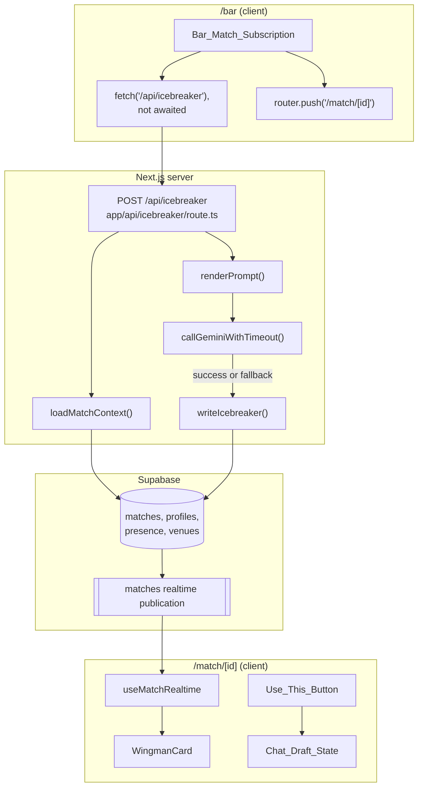
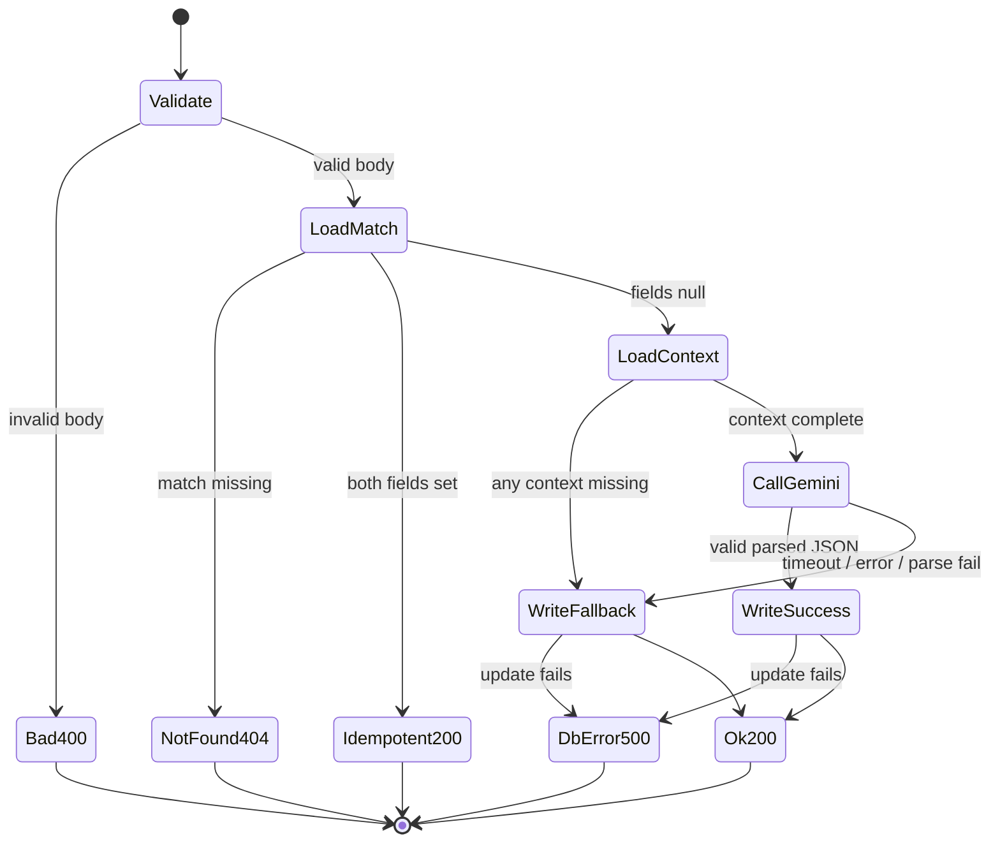

# Design Document: AI Wingman

## Overview

The AI Wingman feature adds a one-shot, server-side Gemini call to BARCHAT's match flow. When a match is created, the bar floor fires a non-awaited `POST /api/icebreaker` and immediately redirects to `/match/[id]`. The server route loads match context, calls `gemini-2.5-flash` with a structured-JSON schema (per BARCHAT.md section 7), wraps the call in a 5-second `AbortController` timeout, writes `icebreaker` and `icebreaker_tip` to the match row, and returns 200. Any failure path writes a hardcoded fallback so the match page always renders something. The match page receives the icebreaker via the existing realtime subscription on `matches` and renders a card between the countdown and the chat region with a "Use this" button that stages the icebreaker as a chat draft.

The design strictly observes BARCHAT.md hard rules: no new dependencies (`@google/genai` and `@supabase/supabase-js` are already installed), RLS is disabled so the existing browser/server-shared client suffices, mobile-first 390px viewport, and no schema changes (the `icebreaker` and `icebreaker_tip` columns already exist).

## Architecture



**Key flow properties:**
- The client never blocks on the Gemini call. The redirect to `/match/[id]` happens in the same realtime handler that fires the request.
- The server route is the only writer for `icebreaker` / `icebreaker_tip`. Both the success path and the fallback path produce a write, so the match page's loading state is bounded by `min(Gemini_response_time, 5s)`.
- The match page receives icebreaker fields purely through the existing realtime subscription. No new client-side fetch.

## Components and Interfaces

### Server: `lib/gemini.ts` (extension)

The existing `lib/gemini.ts` already exports the `GoogleGenAI` instance and the model constant. We extend it with a thin, testable wingman helper that encapsulates prompt rendering, timeout handling, and response parsing. Keeping this in `lib/` (rather than inline in the route) makes the Gemini interaction unit-testable without spinning up a Next.js handler.

```typescript
// lib/gemini.ts (extended)
import "server-only";
import { GoogleGenAI, Type } from "@google/genai";

const apiKey = process.env.GEMINI_API_KEY ?? "";
export const ai = new GoogleGenAI({ apiKey });
export const DEFAULT_MODEL = "gemini-2.5-flash";

export const WINGMAN_TIMEOUT_MS = 5000;

export const FALLBACK_RESULT = {
  icebreaker: "Just say hi 👋",
  tip: "Ask what they're drinking.",
} as const;

export interface WingmanPromptInput {
  venue: { name: string; vibe_description: string | null; current_song: string | null };
  profileA: { display_name: string; age: number | null; bio: string | null };
  profileB: { display_name: string; age: number | null; bio: string | null };
  intentA: string;
  intentB: string;
}

export interface WingmanResult {
  icebreaker: string;
  tip: string;
}

/** Renders the BARCHAT section 7 prompt verbatim with interpolated values. */
export function renderWingmanPrompt(input: WingmanPromptInput): string;

/** Calls Gemini with the structured-JSON schema; returns null on any failure
 *  including timeout, network error, abort, or invalid JSON. */
export async function generateIcebreaker(
  input: WingmanPromptInput,
  signal: AbortSignal,
): Promise<WingmanResult | null>;
```

The `responseSchema` config is identical to the snippet in BARCHAT.md section 7:

```typescript
{
  type: Type.OBJECT,
  properties: {
    icebreaker: { type: Type.STRING },
    tip:        { type: Type.STRING },
  },
  required: ["icebreaker", "tip"],
}
```

`thinkingConfig: { thinkingBudget: 0 }` is passed in the same `config` object. The `signal` from the caller's `AbortController` is forwarded to the SDK's `generateContent` request via the request options the SDK exposes; if the SDK does not pass through the abort signal, the helper races the SDK promise against an `AbortError` rejection driven by the signal so the timeout still bounds the wait.

### Server: `app/api/icebreaker/route.ts`

Next.js 14 App Router route handler. Top-level shape:

```typescript
// app/api/icebreaker/route.ts
import { NextResponse } from "next/server";
import { supabase } from "@/lib/supabase";
import {
  generateIcebreaker,
  FALLBACK_RESULT,
  WINGMAN_TIMEOUT_MS,
  type WingmanResult,
} from "@/lib/gemini";

export async function POST(req: Request): Promise<Response>;
```

Algorithm:

1. **Validate body.** Parse JSON; if not an object with a string `match_id`, return 400.
2. **Load match.** `select * from matches where id = match_id`. If not found, return 404.
3. **Idempotency check.** If `match.icebreaker` and `match.icebreaker_tip` are both non-null, return 200 with `{ icebreaker, tip }`.
4. **Load context.** Fetch both profiles (one query each by id), both presence rows (most recent at `match.venue_id` per profile, ordered by `checked_in_at DESC LIMIT 1`), and the venue row.
5. **Missing context fallback.** If any of the four context fetches fails or returns null, skip Gemini and write the `FALLBACK_RESULT` to the match row. Return 200 with the fallback.
6. **Render prompt** via `renderWingmanPrompt`.
7. **Call Gemini with timeout.** Construct an `AbortController`; call `setTimeout(() => controller.abort(), WINGMAN_TIMEOUT_MS)`; pass `controller.signal` to `generateIcebreaker`. Always clear the timer in `finally`.
8. **Determine result.** If `generateIcebreaker` returns a non-null `WingmanResult`, use it. Otherwise use `FALLBACK_RESULT`.
9. **Persist.** `update matches set icebreaker = ..., icebreaker_tip = ... where id = match_id`. If the update errors, return 500.
10. **Respond.** Return 200 with the chosen `{ icebreaker, tip }`.

The `Supabase_Server_Client` here is the same singleton from `lib/supabase.ts`. RLS is disabled (BARCHAT.md section 4), so the anon key has full read/write access. No service-role client is introduced.

### Client: `app/bar/page.tsx` (modification)

Two changes inside the existing `useEffect` that subscribes to `matches`:

```typescript
function fireWingman(matchId: string) {
  // Fire-and-forget. Swallow errors so we never reject globally.
  fetch("/api/icebreaker", {
    method: "POST",
    headers: { "Content-Type": "application/json" },
    body: JSON.stringify({ match_id: matchId }),
  }).catch(() => {});
}

// inside the postgres_changes handler for both profile_a and profile_b filters:
(payload) => {
  fireWingman(payload.new.id);
  router.push(`/match/${payload.new.id}`);
}
```

The fire happens on the same synchronous tick as the redirect. The `.catch(() => {})` guards against unhandled rejections per Requirement 5.4.

### Client: `app/match/[id]/WingmanCard.tsx` (new)

```typescript
interface WingmanCardProps {
  icebreaker: string | null;
  tip: string | null;
  onUseThis: (text: string) => void;
}

export default function WingmanCard(props: WingmanCardProps): JSX.Element;
```

Layout (Tailwind, 390px-friendly):
- Outer container: `rounded-2xl bg-white/5 border border-white/10 p-4 mx-4 my-3`.
- Header label: small dim text "Wingman".
- Primary line: italic, larger; either the icebreaker (quoted with smart quotes) or the placeholder "Wingman is thinking…" with a soft pulse.
- Secondary line: smaller dim text; the tip when available; hidden when null.
- Footer: a "Use this" button, right-aligned. Disabled (`disabled` attribute + reduced opacity) while `icebreaker` is null.

The button's `onClick` calls `onUseThis(icebreaker!)` only when `icebreaker` is non-null.

### Client: `app/match/[id]/page.tsx` (modification)

Three additions:

1. A `chatDraft` state slot:
   ```typescript
   const [chatDraft, setChatDraft] = useState<string | null>(null);
   ```
2. Pull `icebreaker` and `icebreaker_tip` from `match` (already in `MatchData`).
3. Render `<WingmanCard>` between `<CountdownTimer>` and the bottom padding/MetButton block:
   ```tsx
   <WingmanCard
     icebreaker={match.icebreaker}
     tip={match.icebreaker_tip}
     onUseThis={(text) => setChatDraft(text)}
   />
   ```

`chatDraft` is intentionally unused elsewhere in this spec — it is the seam for Task 7 (chat). To prevent unused-state lint warnings, the page can pass it as a prop to a stub or simply read it; the implementation tasks will choose the least invasive option.

### Client: `app/match/[id]/useMatchRealtime.ts` (modification)

The current hook merges only `expires_at` and `met_at` from realtime UPDATE payloads. It must also merge `icebreaker` and `icebreaker_tip`:

```typescript
setMatch((prev) => {
  if (!prev) return prev; // discard partial update if no base state (Req 9.3)
  return {
    ...prev,
    expires_at: payload.new.expires_at ?? prev.expires_at,
    met_at: payload.new.met_at ?? prev.met_at,
    icebreaker: payload.new.icebreaker ?? prev.icebreaker,
    icebreaker_tip: payload.new.icebreaker_tip ?? prev.icebreaker_tip,
  };
});
```

The initial fetch already selects `*`, so the first render either has the icebreaker (idempotent reload) or null (fresh match, awaiting wingman).

## Data Models

### Request and response shapes for `/api/icebreaker`

```typescript
// Request
interface IcebreakerRequest {
  match_id: string; // uuid
}

// 200 response (both happy path and fallback)
interface IcebreakerSuccess {
  icebreaker: string;
  tip: string;
}

// 4xx / 5xx response
interface IcebreakerError {
  error: string;
}
```

### Match context loaded on the server

```typescript
interface MatchContext {
  match: {
    id: string;
    profile_a: string;
    profile_b: string;
    venue_id: string;
    icebreaker: string | null;
    icebreaker_tip: string | null;
  };
  profileA: { display_name: string; age: number | null; bio: string | null };
  profileB: { display_name: string; age: number | null; bio: string | null };
  intentA: string; // from presence row at venue_id, latest
  intentB: string;
  venue: { name: string; vibe_description: string | null; current_song: string | null };
}
```

### Route state machine



### Wingman card visual states

| State | Trigger | Primary line | Secondary line | Button |
|---|---|---|---|---|
| Loading | `icebreaker === null` | "Wingman is thinking…" with subtle pulse | hidden | disabled |
| Ready | `icebreaker` non-empty string | the icebreaker, quoted | the tip if non-null | enabled |

## Correctness Properties

*A property is a characteristic or behavior that should hold true across all valid executions of a system — essentially, a formal statement about what the system should do. Properties serve as the bridge between human-readable specifications and machine-verifiable correctness guarantees.*

(See Acceptance Criteria Testing Prework, captured via the prework tool, for the testability classification of each acceptance criterion.)

### Property 1: Prompt template fidelity

*For any* valid `WingmanPromptInput`, the output of `renderWingmanPrompt(input)` SHALL contain `input.venue.name`, `input.venue.vibe_description`, `input.venue.current_song`, both display names, both ages (rendered as decimal strings or empty when null), both bios, and both intent strings as substrings, AND SHALL contain the verbatim BARCHAT.md section 7 anchor phrases ("You are a wingman helping two strangers at a bar break the ice." and "Generate exactly:").

**Validates: Requirements 1.5**

### Property 2: Idempotent route response

*For any* `Match_Row` whose `icebreaker` and `icebreaker_tip` fields are both non-null, an `Icebreaker_Request` for that match SHALL respond with HTTP 200 whose JSON body equals `{ icebreaker: row.icebreaker, tip: row.icebreaker_tip }` AND SHALL produce zero invocations of `generateIcebreaker`.

**Validates: Requirements 3.1, 3.2, 3.3**

### Property 3: Failure-path always falls back

*For any* simulated failure of the Gemini call — modeled by mocking `generateIcebreaker` to return null (covering timeout, abort, network error, parse failure) — the route handler SHALL persist `FALLBACK_RESULT` to the match row AND respond with HTTP 200 whose body equals `FALLBACK_RESULT`.

**Validates: Requirements 2.2, 2.3, 2.4, 2.5**

### Property 4: Wingman card render contract

*For any* `(icebreaker: string | null, tip: string | null)` pair, rendering `<WingmanCard>`:
- when `icebreaker` is null, the rendered output SHALL contain "Wingman is thinking…", SHALL NOT contain the tip text, AND the "Use this" button element SHALL have its disabled attribute set;
- when `icebreaker` is a non-empty string, the rendered output SHALL contain the icebreaker text, SHALL contain the tip text whenever `tip` is non-empty, AND the "Use this" button element SHALL NOT have its disabled attribute set.

**Validates: Requirements 6.1, 6.2, 6.3, 7.1, 7.2, 7.3, 7.4**

### Property 5: Use-this button preserves all other state

*For any* prior `Match_Page` state, activating the `Use_This_Button` while `icebreaker` is a non-empty string SHALL leave `Chat_Draft_State` equal to that icebreaker AND SHALL leave every other observable state slot (loading, error, match, profiles, presences) byte-equal to its prior value. Activating the button while `icebreaker` is null SHALL leave `Chat_Draft_State` byte-equal to its prior value.

**Validates: Requirements 8.1, 8.3, 8.4**

### Property 6: Realtime merge preserves canonical fields

*For any* prior `MatchData` `prev` and any partial realtime UPDATE payload `new` whose keys are a subset of `{expires_at, met_at, icebreaker, icebreaker_tip}`, the merged state produced by `useMatchRealtime` SHALL equal `prev` for every field absent in `new` AND SHALL equal `new[k]` for every field `k` present and non-undefined in `new` AND SHALL equal `prev` entirely when `prev` is null.

**Validates: Requirements 9.2, 9.3**

## Error Handling

| Scenario | HTTP | DB write | Body | Notes |
|---|---|---|---|---|
| Body is not JSON or missing `match_id` | 400 | none | `{ error }` | Req 4.1 |
| `match_id` not in `matches` | 404 | none | `{ error }` | Req 4.2 |
| Match exists, both icebreaker fields non-null | 200 | none | existing values | Req 3.1 |
| Any of profile/presence/venue fetches fails | 200 | fallback | `FALLBACK_RESULT` | Req 4.3 |
| Gemini network error or rejection | 200 | fallback | `FALLBACK_RESULT` | Req 2.2 |
| Gemini exceeds 5s wall clock | 200 | fallback | `FALLBACK_RESULT` | Req 2.1, 2.2 |
| Gemini returns invalid JSON or missing fields | 200 | fallback | `FALLBACK_RESULT` | Req 2.3 |
| DB update for icebreaker write fails | 500 | none | `{ error }` | Req 4.4, 2.6 |
| Bar page fetch rejects | n/a | n/a | n/a | swallowed via `.catch(() => {})` (Req 5.4) |

Client-side, the wingman card has only two visual states (loading and ready). There is no error state to render because the server guarantees a write within ~5 seconds: the loading placeholder is shown until either the Gemini result or the fallback arrives via realtime.

## Testing Strategy

### When PBT applies

PBT is appropriate for this feature in narrow but high-value places:
- **Pure functions**: prompt rendering and the realtime merge function are pure and have a wide input space.
- **Pure components**: `WingmanCard` is a deterministic function of its props; rendering snapshots can be property-checked with React Testing Library.
- **Pure logic in the route handler**: extracted helpers (idempotency check, failure-to-fallback mapping, use-this state transition) are testable in isolation with mocks for Supabase and Gemini.

PBT is NOT appropriate for:
- The Gemini network call itself — it is an external service and a single-shot API. Verify it integration-style with one or two recorded calls.
- The Supabase queries themselves — the SDK is well-tested; mock-based unit tests cover wiring.
- Realtime delivery latency — observed end-to-end, not properties.
- The `/bar` redirect timing — verified by a single integration test that the `fetch` is unawaited.

### Library and configuration

- Library: **`fast-check`** (TypeScript). The existing `match-page-hero` spec already standardizes on it.
- Test runner: whichever the implementation tasks select (Jest or Vitest); no constraint imposed here.
- Minimum 100 iterations per property test (`fc.assert(... , { numRuns: 100 })` — `numRuns` defaults to 100 but is set explicitly for clarity).
- Each property test is annotated with a comment of the form:
  ```
  // Feature: ai-wingman, Property N: <property text>
  ```

### Test plan

| Test | Type | Target | Notes |
|---|---|---|---|
| `renderWingmanPrompt` template fidelity | property | Property 1 | Generates random venues/profiles/intents; asserts substrings + anchor phrases |
| Idempotent route response | property (with mocks) | Property 2 | Mocks Supabase row reads to return varying `(icebreaker, tip)` pairs; verifies Gemini mock is never called and response body matches |
| Gemini failure → fallback | property (with mocks) | Property 3 | Mocks `generateIcebreaker` to return null over many simulated input shapes; verifies write payload + HTTP body |
| Wingman card render contract | property | Property 4 | Random `(string|null, string|null)` pairs; uses `@testing-library/react` to assert text and disabled state |
| Use-this state transition | property | Property 5 | Models the page state as a small record; verifies invariants on activate |
| Realtime merge | property | Property 6 | Generates random `prev` and `new` payloads as subsets of the merged keys |
| Route 400 on bad body | unit (example) | Req 4.1 | Sends `null`, `{}`, `{ match_id: 5 }` |
| Route 404 on unknown match | unit (example) | Req 4.2 | Mocks Supabase to return null |
| Route 500 on update failure | unit (example) | Req 4.4 | Mocks Supabase update to error |
| 5-second timeout fires | unit | Req 2.1 | Mocks `generateIcebreaker` to wait 6s; uses fake timers; asserts response within ≤5s and body equals fallback |
| Bar fire-and-forget | unit | Req 5.1, 5.2, 5.3, 5.4 | Mocks `fetch` and `router.push`; asserts both called in same tick and `fetch` is not awaited |
| End-to-end wingman appears on match | integration | Req 9.1, 6.1 | Seeds a match row, calls the route, asserts the realtime hook surfaces the icebreaker |

### Test placement and naming

- Helpers in `lib/gemini.ts`: tests in `lib/__tests__/gemini.test.ts`.
- Route handler: tests in `app/api/icebreaker/__tests__/route.test.ts`.
- `WingmanCard`: tests in `app/match/[id]/__tests__/WingmanCard.test.tsx`.
- Realtime merge: tests in `app/match/[id]/__tests__/useMatchRealtime.test.ts`.

### Out-of-scope verification

- Streaming Gemini responses (BARCHAT.md says single shot only).
- Auth, rate limiting, exponential backoff, retries.
- Non-mobile viewports.
- Schema changes (the columns already exist).
