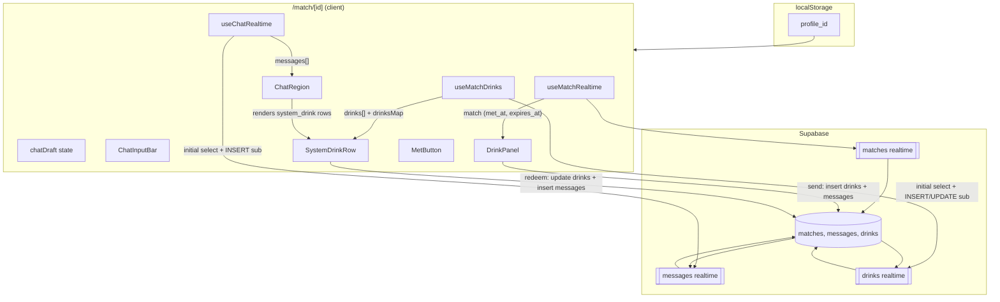
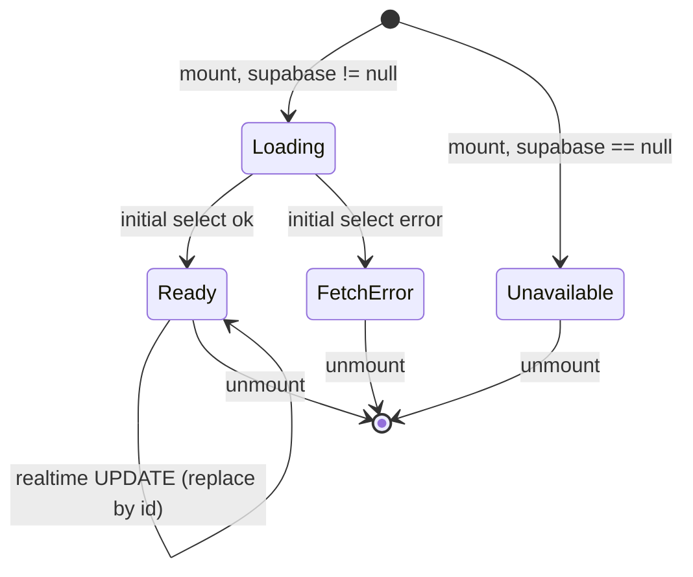

# Design Document: Drinks & Redeem

## Overview

The Drinks & Redeem feature adds the "send a drink → redeem at counter" flow to BARCHAT's hero match page (`/match/[id]`). It implements BARCHAT.md Task 8 and demo-choreography step 8: "Nine taps 🍺 Beer ฿120 → system message appears in both chats. Mai taps 'Redeem at counter' → status update."

The feature composes with the just-shipped match-chat feature:

- **Existing pipe re-used:** `messages` rows of `kind='system_drink'` already flow through `useChatRealtime.ts` (initial fetch + realtime INSERT subscription) and render via `<SystemDrinkRow />`. No changes to that pipe are needed — new `system_drink` rows inserted by the drink/redeem flows arrive on both screens automatically.
- **New pipe added:** A `useMatchDrinks(matchId)` hook opens a realtime subscription on the `drinks` table (INSERT + UPDATE), mirroring `useChatRealtime`'s shape (initial fetch → realtime → cleanup). It exposes a `drinks: DrinkRow[]` array and a `Map<string, DrinkRow>` lookup so `SystemDrinkRow` can resolve the linked drink's status without a per-message query.
- **`SystemDrinkRow` extended:** The component gains a `drink?: DrinkRow` prop and a `currentUserId` prop. It renders kind-aware emoji from the catalog, a human-readable send/redeem string, and a conditional "Redeem at counter" button.

The feature observes BARCHAT.md hard rules verbatim:
- No auth — `Current_User_Id` is read from `localStorage` under the existing check-in key.
- Mobile-first 390px viewport — every new component renders correctly inside `max-w-[390px]`.
- Tailwind only — no new CSS frameworks, no new state libraries.
- RLS disabled — the anon-key client writes directly to `drinks` and `messages`.
- No optimistic UI — sent drinks and redeems appear via realtime only (Req 5.2, Out-of-Scope item 10).
- No payments — drinks are a Web2 simulation (BARCHAT.md section 4).

The design is deliberately small. The drink catalog is a static constant, the encoding scheme is a versioned JSON envelope inside `messages.content`, and the disabled-state derivation re-uses the same `matchEnded` expression from the chat input. Almost all rendering logic is pure, making property-based testing the right shape for correctness verification.

## Architecture



**Key flow properties:**

- The `useMatchDrinks` hook is the single source of truth for drink status on the client. `SystemDrinkRow` receives a `DrinkRow | undefined` prop looked up from the hook's `drinksMap`; it never queries Supabase itself.
- The drink panel's disabled state is derived from the same `matchEnded` expression that drives `ChatInputBar.disabled` (Req 6.4). Both transition together on the same render cycle.
- The `messages.content` field for `system_drink` rows uses a versioned JSON envelope (`{ v: 1, ... }`). The renderer parses it; on parse failure it falls back to rendering the raw content as plain text (graceful degradation for any rows written by older code or manual DB edits).
- The send flow is a two-step sequential insert (drink row first, then message row). If the drink insert fails, no message is inserted. If the message insert fails after the drink succeeded, the drink is kept (it represents a real liability at the bar counter).
- The redeem flow is a two-step sequential operation (update drink status, then insert confirmation message). Same partial-failure semantics: a redeemed drink is never rolled back.

## Components and Interfaces

### New: `app/match/[id]/drinkCatalog.ts`

Single source of truth for drink kinds, labels, emojis, and prices (Req 2.1).

```typescript
export type DrinkKind = "beer" | "cocktail" | "mocktail";

export interface DrinkCatalogEntry {
  kind: DrinkKind;
  label: string;
  emoji: string;
  price_thb: number;
}

export const DRINK_CATALOG: Record<DrinkKind, DrinkCatalogEntry> = {
  beer:     { kind: "beer",     label: "Beer",     emoji: "🍺", price_thb: 120 },
  cocktail: { kind: "cocktail", label: "Cocktail", emoji: "🍸", price_thb: 250 },
  mocktail: { kind: "mocktail", label: "Mocktail", emoji: "🥤", price_thb: 150 },
} as const;

/** Ordered array for rendering the three buttons left-to-right. */
export const DRINK_CATALOG_LIST: DrinkCatalogEntry[] = [
  DRINK_CATALOG.beer,
  DRINK_CATALOG.cocktail,
  DRINK_CATALOG.mocktail,
];

export interface DrinkRow {
  id: string;
  match_id: string;
  from_profile: string;
  to_profile: string;
  drink_type: DrinkKind;
  price_thb: number;
  status: "pending" | "redeemed";
  created_at: string;
  redeemed_at: string | null;
}
```

### New: `app/match/[id]/useMatchDrinks.ts`

Mirrors the shape of `useChatRealtime`: initial fetch + realtime INSERT/UPDATE subscription + cleanup. Exposes a `drinks` array and a `drinksMap` for O(1) lookup by drink id.

```typescript
"use client";
import { useState, useEffect, useRef, useCallback } from "react";
import { supabase } from "@/lib/supabase";
import type { RealtimeChannel } from "@supabase/supabase-js";
import type { DrinkRow } from "./drinkCatalog";

export type DrinksStatus = "loading" | "ready" | "fetch_error" | "unavailable";

export interface UseMatchDrinksResult {
  drinks: DrinkRow[];
  drinksMap: Map<string, DrinkRow>;
  status: DrinksStatus;
}

export function useMatchDrinks(matchId: string): UseMatchDrinksResult;
```

Implementation contract:

1. **Supabase null short-circuit (Req 11.3, 12).** If `supabase` is `null`, set `status` to `"unavailable"`, leave `drinks` empty, and skip both the fetch and the subscription.
2. **Initial fetch (Req 11.1).** On mount with a non-empty `matchId`, run `supabase.from("drinks").select("*").eq("match_id", matchId)`. On success, set `drinks` to the returned rows and `status` to `"ready"`. On error, leave `drinks` empty and set `status` to `"fetch_error"` (Req 11.4).
3. **Subscription (Req 12.1).** Open a channel `drinks-${matchId}` and listen for `postgres_changes` on `public.drinks` filtered by `match_id=eq.${matchId}` for both `INSERT` and `UPDATE` events.
4. **INSERT handler (Req 12.3).** On INSERT payload, append `payload.new` to `drinks` only if no existing row has the same `id` (dedup). Rebuild `drinksMap`.
5. **UPDATE handler (Req 12.2).** On UPDATE payload, replace the existing row with the same `id` in `drinks`. If `payload.new` is missing or malformed, discard silently. Rebuild `drinksMap`.
6. **Cleanup (Req 12.4).** On unmount, call `supabase.removeChannel(channel)` and null the ref.
7. **`drinksMap` derivation.** Computed from `drinks` on every state change: `new Map(drinks.map(d => [d.id, d]))`. This gives `SystemDrinkRow` O(1) lookup by drink id extracted from the message content.
8. **Cancellation guard.** A `cancelled` flag prevents state writes after unmount, mirroring `useChatRealtime`.

### New: `app/match/[id]/DrinkPanel.tsx`

The drink-send UI. Three buttons in a horizontal row, plus an inline error slot.

```typescript
"use client";

import { DRINK_CATALOG_LIST, type DrinkKind } from "./drinkCatalog";

export interface DrinkPanelProps {
  disabled: boolean;
  sending: boolean;
  sendError: string | null;
  onSendDrink: (kind: DrinkKind) => void;
}

export default function DrinkPanel(props: DrinkPanelProps): JSX.Element;
```

Layout and behavior:

- Wrapper: `flex items-center justify-around gap-2 px-4 py-2 border-t border-white/10 bg-black/60 backdrop-blur-sm`.
- Each button iterates `DRINK_CATALOG_LIST` and renders: `{entry.emoji} {entry.label} ฿{entry.price_thb}` (Req 2.2–2.4).
- Button styling: `flex-1 text-center text-xs rounded-xl px-2 py-2 bg-white/10 border border-white/10 text-white hover:bg-white/20 active:scale-[0.97] transition-all disabled:opacity-50 disabled:cursor-not-allowed`.
- `disabled` prop: `props.disabled || props.sending` — both the match-ended state and the in-flight guard disable all three buttons (Req 3.3, 6.1).
- `onClick`: calls `props.onSendDrink(entry.kind)`.
- Error slot: when `sendError` is non-null, render a `<p>` below the buttons with the literal error text, styled `text-xs text-red-300 text-center mt-1`.

### New: `app/match/[id]/drinkMessageCodec.ts`

Encodes and decodes the JSON envelope stored in `messages.content` for `system_drink` rows.

```typescript
import type { DrinkKind } from "./drinkCatalog";

/** Version 1 envelope for system_drink message content. */
export interface DrinkMessagePayload {
  v: 1;
  type: "send" | "redeem";
  drink_id: string;
  drink_type: DrinkKind;
  price_thb: number;
  sender_name: string;
  recipient_name: string;
}

/**
 * Encode a drink event into the JSON string stored in `messages.content`.
 * Deterministic: same inputs always produce the same output.
 */
export function encodeDrinkMessage(payload: DrinkMessagePayload): string {
  return JSON.stringify(payload);
}

/**
 * Decode a `messages.content` string back into a typed payload.
 * Returns `null` on any parse failure (malformed JSON, missing fields,
 * wrong version, unknown type). The caller falls back to rendering the
 * raw content as plain text.
 */
export function decodeDrinkMessage(content: string): DrinkMessagePayload | null {
  try {
    const obj = JSON.parse(content);
    if (
      obj &&
      obj.v === 1 &&
      (obj.type === "send" || obj.type === "redeem") &&
      typeof obj.drink_id === "string" &&
      typeof obj.drink_type === "string" &&
      typeof obj.price_thb === "number" &&
      typeof obj.sender_name === "string" &&
      typeof obj.recipient_name === "string"
    ) {
      return obj as DrinkMessagePayload;
    }
    return null;
  } catch {
    return null;
  }
}
```

**Parse-failure fallback:** When `decodeDrinkMessage` returns `null`, `SystemDrinkRow` renders the raw `content` string as plain text with the generic `🍺` prefix (matching the match-chat spec's original behavior). This ensures backward compatibility with any `system_drink` rows that predate this encoding scheme or were manually inserted.

### Modified: `app/match/[id]/SystemDrinkRow.tsx`

Extended (not replaced) to accept optional drink state and render kind-aware content.

```typescript
"use client";

import { DRINK_CATALOG, type DrinkKind } from "./drinkCatalog";
import { decodeDrinkMessage } from "./drinkMessageCodec";
import type { DrinkRow } from "./drinkCatalog";

export interface SystemDrinkRowProps {
  content: string;
  /** The linked DrinkRow from useMatchDrinks, if resolvable. */
  drink?: DrinkRow;
  /** Current user's profile id, needed for redeem-button visibility. */
  currentUserId?: string;
  /** Called when the user taps "Redeem at counter". */
  onRedeem?: (drinkId: string) => void;
  /** Whether a redeem action is currently in flight for this drink. */
  redeemingId?: string | null;
  /** Inline redeem error for this specific drink. */
  redeemError?: string | null;
}

export default function SystemDrinkRow(props: SystemDrinkRowProps): JSX.Element;
```

Rendering logic:

1. **Decode content.** Call `decodeDrinkMessage(props.content)`. If `null`, fall back to legacy rendering: `"🍺 " + props.content` (no redeem button, no kind-awareness).
2. **Resolve emoji.** Look up `DRINK_CATALOG[payload.drink_type]?.emoji` — if the drink_type is unknown, fall back to `"🍺"`.
3. **Render text.**
   - For `type === "send"`: `"{emoji} {sender_name} sent {recipient_name} a {emoji} {label} ฿{price_thb}"` — e.g. `"🍺 Nine sent Mai a 🍺 Beer ฿120"`.
   - For `type === "redeem"`: `"{emoji} {recipient_name} redeemed the {emoji} {label}"` — e.g. `"🍺 Mai redeemed the 🍺 Beer"`.
4. **Redeem button (Req 8.1).** Render `<button>Redeem at counter</button>` IF AND ONLY IF:
   - `payload.type === "send"` (not on redeem messages — Req 8.4), AND
   - `props.drink` is defined (drink state loaded), AND
   - `props.drink.status === "pending"` (Req 8.3), AND
   - `props.drink.to_profile === props.currentUserId` (Req 8.1a, 13.1).
5. **Redeem button disabled.** `props.redeemingId === props.drink?.id` (in-flight guard — Req 9.3).
6. **Redeem error.** When `props.redeemError` is non-null and the drink id matches, render the error text below the button.
7. **Layout preserved.** Outer wrapper: `flex w-full justify-center`. Inner pill: `w-full text-center text-xs text-white/60 italic px-3 py-2 rounded-xl bg-white/5 border border-white/10`. Redeem button nested inside the pill: `mt-1 px-2 py-1 text-xs rounded-lg bg-green-600/80 text-white not-italic hover:bg-green-500 disabled:opacity-50`.

### Modified: `app/match/[id]/ChatRegion.tsx`

Minimal change: the `system_drink` rendering branch now passes additional props to `SystemDrinkRow`.

```typescript
// Updated ChatRegionProps (additions only)
export interface ChatRegionProps {
  // ... existing props from match-chat ...
  /** Drink state map from useMatchDrinks, keyed by drink id. */
  drinksMap?: Map<string, DrinkRow>;
  /** Current user id for redeem-button visibility. */
  currentUserId: string; // already present
  /** Called when user taps "Redeem at counter" on a drink message. */
  onRedeem?: (drinkId: string) => void;
  /** The drink id currently being redeemed (in-flight guard). */
  redeemingId?: string | null;
  /** Inline redeem error keyed to a specific drink id. */
  redeemError?: string | null;
}
```

In the message-rendering loop, the `system_drink` branch becomes:

```typescript
if (m.kind === "system_drink") {
  const payload = decodeDrinkMessage(m.content);
  const linkedDrink = payload ? drinksMap?.get(payload.drink_id) : undefined;
  return (
    <SystemDrinkRow
      key={m.id}
      content={m.content}
      drink={linkedDrink}
      currentUserId={currentUserId}
      onRedeem={onRedeem}
      redeemingId={redeemingId}
      redeemError={
        redeemError && linkedDrink?.id === redeemingId ? redeemError : null
      }
    />
  );
}
```

### Modified: `app/match/[id]/page.tsx`

Structural additions to wire the drink panel and the drink-state hook into the existing page layout.

**State additions:**

```typescript
import { useMatchDrinks } from "./useMatchDrinks";
import { DRINK_CATALOG, type DrinkKind } from "./drinkCatalog";
import { encodeDrinkMessage } from "./drinkMessageCodec";
import DrinkPanel from "./DrinkPanel";

// Inside MatchPage():
const { drinks, drinksMap, status: drinksStatus } = useMatchDrinks(matchId);

// Drink-send in-flight guard (Req 3.3)
const [drinkSending, setDrinkSending] = useState(false);
const [drinkSendError, setDrinkSendError] = useState<string | null>(null);

// Redeem in-flight guard (Req 9.3)
const [redeemingId, setRedeemingId] = useState<string | null>(null);
const [redeemError, setRedeemError] = useState<string | null>(null);
```

**Disabled-state derivation (Req 6.4):** Re-uses the SAME `matchEnded` expression already computed for `ChatInputBar`:

```typescript
// Already exists from match-chat:
const matchEnded =
  match.met_at !== null || Date.parse(match.expires_at) <= Date.now();

// DrinkPanel disabled = matchEnded || supabase is null
const drinkPanelDisabled = matchEnded || !supabase;
```

**Drink send flow (Req 3.1, 4.1, 4.2):**

```typescript
const handleSendDrink = async (kind: DrinkKind) => {
  if (matchEnded) return; // Req 6.2: abort if match ended mid-flight
  if (!supabase) {
    setDrinkSendError("Couldn't send drink. Tap to retry.");
    return;
  }
  if (drinkSending) return; // Req 3.3: ignore while in-flight

  setDrinkSending(true);
  setDrinkSendError(null);

  // Re-check matchEnded right before insert (Req 6.2)
  const nowEnded =
    match!.met_at !== null || Date.parse(match!.expires_at) <= Date.now();
  if (nowEnded) {
    setDrinkSending(false);
    return;
  }

  const catalogEntry = DRINK_CATALOG[kind];
  const otherUserId =
    match!.profile_a === currentUserId
      ? match!.profile_b
      : match!.profile_a;

  // Step 1: Insert drink row (Req 3.1)
  const { data: drinkData, error: drinkError } = await supabase
    .from("drinks")
    .insert({
      match_id: matchId,
      from_profile: currentUserId,
      to_profile: otherUserId,
      drink_type: kind,
      price_thb: catalogEntry.price_thb,
      status: "pending",
    })
    .select("id")
    .single();

  if (drinkError || !drinkData) {
    setDrinkSendError("Couldn't send drink. Tap to retry.");
    setDrinkSending(false);
    return; // Req 3.4: no message insert on drink failure
  }

  // Step 2: Insert system_drink message (Req 4.1, 4.2)
  // Resolve display names from profiles (already loaded by useMatchRealtime)
  const senderName =
    match!.profile_a === currentUserId
      ? profiles.a?.display_name ?? "Someone"
      : profiles.b?.display_name ?? "Someone";
  const recipientName =
    match!.profile_a === otherUserId
      ? profiles.a?.display_name ?? "Someone"
      : profiles.b?.display_name ?? "Someone";

  const content = encodeDrinkMessage({
    v: 1,
    type: "send",
    drink_id: drinkData.id,
    drink_type: kind,
    price_thb: catalogEntry.price_thb,
    sender_name: senderName,
    recipient_name: recipientName,
  });

  const { error: msgError } = await supabase
    .from("messages")
    .insert({
      match_id: matchId,
      sender_id: currentUserId,
      kind: "system_drink",
      content,
    })
    .select("id")
    .single();

  if (msgError) {
    // Req 4.4: drink row stays; show error
    setDrinkSendError("Couldn't send drink. Tap to retry.");
  }

  setDrinkSending(false);
};
```

**Redeem flow (Req 9.1, 9.2, 10.1, 10.3):**

```typescript
const handleRedeem = async (drinkId: string) => {
  if (!supabase) return;
  if (redeemingId) return; // Req 9.3: ignore while in-flight

  // Req 13.2: defensive guard — only the recipient can redeem
  const drink = drinksMap.get(drinkId);
  if (!drink || drink.to_profile !== currentUserId) return;
  // Req 9.2: only update pending drinks
  if (drink.status !== "pending") return;

  setRedeemingId(drinkId);
  setRedeemError(null);

  // Step 1: Update drink row (Req 9.1)
  const { error: updateError } = await supabase
    .from("drinks")
    .update({ status: "redeemed", redeemed_at: new Date().toISOString() })
    .eq("id", drinkId)
    .eq("status", "pending"); // Req 9.2: conditional update

  if (updateError) {
    setRedeemError("Couldn't redeem. Tap to retry.");
    setRedeemingId(null);
    return; // Req 9.4: no message insert on update failure
  }

  // Step 2: Insert redeem confirmation message (Req 10.1, 10.3)
  const catalogEntry = DRINK_CATALOG[drink.drink_type];
  const redeemerName =
    match!.profile_a === currentUserId
      ? profiles.a?.display_name ?? "Someone"
      : profiles.b?.display_name ?? "Someone";

  const content = encodeDrinkMessage({
    v: 1,
    type: "redeem",
    drink_id: drinkId,
    drink_type: drink.drink_type,
    price_thb: drink.price_thb,
    sender_name: drink.from_profile === match!.profile_a
      ? profiles.a?.display_name ?? "Someone"
      : profiles.b?.display_name ?? "Someone",
    recipient_name: redeemerName,
  });

  const { error: msgError } = await supabase
    .from("messages")
    .insert({
      match_id: matchId,
      sender_id: currentUserId,
      kind: "system_drink",
      content,
    })
    .select("id")
    .single();

  if (msgError) {
    // Req 10.2: drink stays redeemed; show specific error
    setRedeemError("Redeemed, but couldn't post confirmation. Tap to retry.");
  }

  setRedeemingId(null);
};
```

**Layout change.** The page's flex column gains `DrinkPanel` between `ChatInputBar` and the closing `</div>` (before `MetButton`). The `pb-[6rem]` padding already clears the fixed `MetButton`; the drink panel sits inside the bounded column and does not affect the fixed-position component.

```
<main class="h-[100dvh] flex flex-col max-w-[390px] mx-auto bg-gray-950 pb-[6rem]">
  ProfileHeader
  CountdownTimer
  WingmanCard
  ChatRegion          // flex-1 min-h-0 overflow-y-auto
  ChatInputBar        // natural height
  DrinkPanel          // natural height (Req 1.1: between chat input and MetButton)
</main>
<MetButton ... />     // unchanged: fixed at viewport bottom
```

### Unchanged components

- **`useChatRealtime.ts`** — No changes. System-drink messages flow through the existing INSERT subscription.
- **`useMatchRealtime.ts`** — No changes. Provides `match`, `profiles`, `presences` as before.
- **`ChatInputBar.tsx`** — No changes. Its `disabled` prop is still driven by `matchEnded`.
- **`MetButton.tsx`** — No changes. Remains fixed at the viewport bottom.
- **`MessageBubble.tsx`** — No changes. Only renders `kind === "text"` rows.

## Data Models

### `DrinkRow`

Mirrors the `drinks` table schema verbatim (BARCHAT.md section 5). Column names match the DB exactly: `from_profile`, `to_profile`, `drink_type`.

```typescript
export interface DrinkRow {
  id: string;              // uuid, server-generated
  match_id: string;        // uuid
  from_profile: string;    // uuid — the sender
  to_profile: string;      // uuid — the recipient
  drink_type: DrinkKind;   // 'beer' | 'cocktail' | 'mocktail'
  price_thb: number;       // integer
  status: "pending" | "redeemed";
  created_at: string;      // ISO timestamp
  redeemed_at: string | null;
}
```

### `DrinkMessagePayload` (JSON envelope in `messages.content`)

```typescript
export interface DrinkMessagePayload {
  v: 1;                    // version tag for forward compatibility
  type: "send" | "redeem"; // distinguishes send-messages from redeem-messages
  drink_id: string;        // links back to the DrinkRow
  drink_type: DrinkKind;   // redundant with DrinkRow but avoids a lookup for rendering
  price_thb: number;       // redundant but avoids a lookup
  sender_name: string;     // display_name of from_profile at write time
  recipient_name: string;  // display_name of to_profile at write time
}
```

Design rationale for the envelope:

- **`v: 1`** — allows future schema evolution without breaking existing rows.
- **`type`** — the renderer dispatches on this to choose the send vs redeem text template.
- **`drink_id`** — the link between the message and the `DrinkRow`. `SystemDrinkRow` uses this to look up the drink's current `status` from `drinksMap` for redeem-button visibility.
- **`drink_type` + `price_thb`** — denormalized so the renderer can show emoji + price without hitting `drinksMap` (graceful degradation if the drink hasn't arrived via realtime yet).
- **`sender_name` + `recipient_name`** — snapshot at write time. If a user later changes their display name, old messages still read correctly. View-independent: both screens render the same string (Req 4.3, 10.4).

### Drinks hook state machine



### Rendering decision table for `SystemDrinkRow`

| Payload decode | `type` | `drink` prop | `drink.status` | `drink.to_profile === currentUserId` | Redeem button? | Visible text template |
|---|---|---|---|---|---|---|
| success | `"send"` | defined | `"pending"` | yes | YES | `{emoji} {sender} sent {recipient} a {emoji} {label} ฿{price}` |
| success | `"send"` | defined | `"pending"` | no | no | same text, no button |
| success | `"send"` | defined | `"redeemed"` | yes | no | same text, no button |
| success | `"send"` | defined | `"redeemed"` | no | no | same text, no button |
| success | `"send"` | undefined | — | — | no | same text, no button (drink not yet loaded) |
| success | `"redeem"` | any | any | any | no | `{emoji} {recipient} redeemed the {emoji} {label}` |
| failure (null) | — | — | — | — | no | `"🍺 " + raw content` (legacy fallback) |

## Correctness Properties

*A property is a characteristic or behavior that should hold true across all valid executions of a system — essentially, a formal statement about what the system should do. Properties serve as the bridge between human-readable specifications and machine-verifiable correctness guarantees.*

### Property 1: Drink button labels are derived from the catalog

*For any* `DrinkCatalogEntry` `e` in `DRINK_CATALOG_LIST`, rendering `<DrinkPanel>` SHALL produce a button whose visible `textContent` equals the string `${e.emoji} ${e.label} ฿${e.price_thb}`.

**Validates: Requirements 2.2, 2.3, 2.4**

### Property 2: Drink send insert payload matches the catalog

*For any* `DrinkKind` `K` drawn from the keys of `DRINK_CATALOG`, performing a `Drink_Send_Action` with kind `K` SHALL produce an insert payload to `drinks` with `drink_type = K` AND `price_thb = DRINK_CATALOG[K].price_thb` AND `from_profile = Current_User_Id` AND `to_profile = Other_User_Id` AND `status = "pending"`.

**Validates: Requirements 3.1, 3.2**

### Property 3: Send-message content encoding round-trip

*For any* valid `DrinkMessagePayload` `p` with `p.type === "send"`, `decodeDrinkMessage(encodeDrinkMessage(p))` SHALL return a value deeply equal to `p`. Specifically, the decoded result SHALL preserve `sender_name`, `recipient_name`, `drink_type`, `price_thb`, `drink_id`, and `type`.

**Validates: Requirements 4.2, 4.3**

### Property 4: Redeem-message content encoding round-trip

*For any* valid `DrinkMessagePayload` `p` with `p.type === "redeem"`, `decodeDrinkMessage(encodeDrinkMessage(p))` SHALL return a value deeply equal to `p`. Specifically, the decoded result SHALL preserve `recipient_name`, `drink_type`, `drink_id`, and `type === "redeem"`.

**Validates: Requirements 10.3, 10.4**

### Property 5: Drink panel disabled state equals matchEnded

*For any* `match.met_at: string | null`, `match.expires_at: string` (ISO timestamp), and `now: number` (epoch ms), the `disabled` prop passed to each `Drink_Button` SHALL equal `match.met_at !== null || Date.parse(match.expires_at) <= now` — the same expression that drives `ChatInputBar.disabled`.

**Validates: Requirements 6.1, 6.4**

### Property 6: Kind-aware emoji rendering for send messages

*For any* valid `DrinkMessagePayload` `p` with `p.type === "send"` and any `DrinkKind` `K = p.drink_type`, rendering `<SystemDrinkRow content={encodeDrinkMessage(p)} drink={...} ...>` SHALL produce visible text that contains `DRINK_CATALOG[K].emoji` AND `p.sender_name` AND `p.recipient_name` AND `DRINK_CATALOG[K].label` AND the string representation of `p.price_thb`.

**Validates: Requirements 7.1, 7.2, 7.3**

### Property 7: Kind-aware emoji rendering for redeem messages

*For any* valid `DrinkMessagePayload` `p` with `p.type === "redeem"` and any `DrinkKind` `K = p.drink_type`, rendering `<SystemDrinkRow content={encodeDrinkMessage(p)} ...>` SHALL produce visible text that contains `DRINK_CATALOG[K].emoji` AND `p.recipient_name` AND `DRINK_CATALOG[K].label`.

**Validates: Requirements 7.4**

### Property 8: Redeem button visibility predicate

*For any* `DrinkMessagePayload` `p`, `DrinkRow | undefined` `drink`, and `currentUserId: string`, rendering `<SystemDrinkRow content={encodeDrinkMessage(p)} drink={drink} currentUserId={currentUserId} ...>`:
- SHALL render a button with text `"Redeem at counter"` IF AND ONLY IF `p.type === "send"` AND `drink` is defined AND `drink.status === "pending"` AND `drink.to_profile === currentUserId`;
- SHALL NOT render any such button in all other cases.

**Validates: Requirements 8.1, 8.3, 8.4, 13.1**

### Property 9: Redeem action guard

*For any* `DrinkRow` `d` and `currentUserId: string`, invoking `handleRedeem(d.id)`:
- SHALL issue an update call IF AND ONLY IF `d.status === "pending"` AND `d.to_profile === currentUserId`;
- SHALL be a no-op (no update, no message insert) in all other cases.

**Validates: Requirements 9.2, 13.2**

### Property 10: Realtime UPDATE replaces local drink state

*For any* existing `DrinkRow[]` `ds` and any valid UPDATE payload `u` whose `id` matches some `d ∈ ds`, applying the UPDATE through `useMatchDrinks` SHALL produce a `drinks` array where the element with `id === u.id` has `status === u.status` AND `redeemed_at === u.redeemed_at`, and all other elements are unchanged.

**Validates: Requirements 12.2**

### Property 11: Realtime INSERT appends new drink to local state

*For any* existing `DrinkRow[]` `ds` and any valid INSERT payload `n` whose `id` does NOT appear in `ds`, applying the INSERT through `useMatchDrinks` SHALL produce a `drinks` array whose length equals `ds.length + 1` AND whose `id` set equals `setOf(ds.map(id)) ∪ {n.id}`.

**Validates: Requirements 12.3**

## Error Handling

| Scenario | Trigger | Render path | State path | Notes |
|---|---|---|---|---|
| Supabase client is null at mount | `lib/supabase.ts` exports `null` | DrinkPanel disabled; no redeem buttons rendered | `drinksStatus = "unavailable"`; `drinks = []` | Req 6.3, 11.3 |
| Initial drinks fetch errors | `supabase.from("drinks").select(...)` returns `{ error }` | No redeem buttons rendered on any message | `drinksStatus = "fetch_error"`; `drinks = []` | Req 11.4 |
| Drink send insert fails | Network error or DB constraint violation | Inline error `"Couldn't send drink. Tap to retry."` in DrinkPanel | `drinkSending = false`; `drinkSendError` set | Req 3.4 |
| Message insert fails after drink insert succeeds | Network error on second insert | Same inline error in DrinkPanel; drink row preserved | `drinkSending = false`; `drinkSendError` set | Req 4.4 |
| Redeem update fails | Network error or race condition | Inline error `"Couldn't redeem. Tap to retry."` on the message | `redeemingId = null`; `redeemError` set | Req 9.4 |
| Redeem message insert fails after update succeeds | Network error on second insert | Inline error `"Redeemed, but couldn't post confirmation. Tap to retry."` | `redeemingId = null`; `redeemError` set; drink stays redeemed | Req 10.2 |
| Double-tap on drink button while in-flight | User taps rapidly | Second tap ignored; only one insert issued | `drinkSending` flag gates | Req 3.3 |
| Double-tap on redeem button while in-flight | User taps rapidly | Second tap ignored; only one update issued | `redeemingId` flag gates | Req 9.3 |
| Drink send attempted after match ends mid-flight | `met_at` flips or `expires_at` passes between tap and insert | Action aborted; no insert issued | `drinkSending = false` | Req 6.2 |
| Realtime UPDATE with malformed payload | Missing fields or wrong types | Event discarded silently; local state unchanged | No state change | Req 12.2 |
| Decode failure on `messages.content` | Malformed JSON or missing fields | Legacy fallback: `"🍺 " + raw content`; no redeem button | No state change | Parse-failure fallback |
| Redeem attempted on already-redeemed drink | Race: other user redeemed first | `handleRedeem` short-circuits on `status !== "pending"` | No update issued | Req 9.2 |
| Redeem attempted by wrong user | Defensive: `to_profile !== currentUserId` | `handleRedeem` short-circuits | No update issued | Req 13.2 |

## Testing Strategy

### When PBT applies

PBT fits this feature in high-value places:

- **Pure codec functions** — `encodeDrinkMessage` / `decodeDrinkMessage` are deterministic pure functions with a wide input space (any combination of names, drink types, prices, UUIDs). Round-trip properties catch encoding/decoding regressions across the input space.
- **Pure rendering logic** — `SystemDrinkRow`'s text output and redeem-button visibility are deterministic functions of their props. Property tests with random payloads verify the emoji, text template, and button-visibility predicate across all valid inputs.
- **Pure derivation** — the disabled-state predicate and the redeem-action guard are pure functions of their inputs; property tests with random state verify boundary conditions.
- **Pure list-merge logic** — the `useMatchDrinks` hook's INSERT/UPDATE handlers are pure functions over drink arrays; property tests with random drink sequences verify dedup and replacement.

PBT is NOT appropriate for:

- The realtime channel lifecycle (`subscribe`, `removeChannel`) — wiring assertions; one example test each.
- The 390px viewport rendering — visual correctness verified via snapshot tests and demo dry-run.
- The DOM ordering of page elements — single integration test.
- The in-flight concurrency guards — timing-dependent; example tests with mocked delays.

### Library and configuration

- Library: **`fast-check`** (TypeScript), matching the match-chat spec's choice.
- Test runner: Vitest (or Jest); no constraint imposed.
- Minimum **100 iterations** per property test (`fc.assert(prop, { numRuns: 100 })`).
- Each property test annotated with a comment:
  ```
  // Feature: drinks-redeem, Property N: <property text>
  ```
- Generators live in `app/match/[id]/__tests__/drinks-generators.ts`.

### Generator design

- `arbDrinkKind()` — `fc.constantFrom("beer", "cocktail", "mocktail")`.
- `arbDrinkId()` — `fc.uuidV(4)`.
- `arbDisplayName()` — `fc.string({ minLength: 1, maxLength: 50 })` with a mix-in for Thai characters and emoji.
- `arbPriceThb()` — `fc.constantFrom(120, 250, 150)` (catalog prices only).
- `arbDrinkMessagePayload(type?)` — composes the above into a `DrinkMessagePayload` with `v: 1`.
- `arbDrinkRow(matchId, possibleProfiles)` — generates a `DrinkRow` with random status, drink_type from catalog, and from/to from the two-element profiles array.
- `arbDrinkStatus()` — `fc.constantFrom("pending", "redeemed")`.
- `arbMetAt()` — `fc.option(fc.date().map(d => d.toISOString()), { nil: null })`.
- `arbExpiresAt()` — `fc.date({ min: new Date(2024, 0, 1), max: new Date(2030, 0, 1) }).map(d => d.toISOString())`.

### Test plan

| # | Test | Type | Target | Notes |
|---|---|---|---|---|
| 1 | Button labels match catalog template | property | Property 1 | For each catalog entry, assert rendered text matches template. 100 runs (randomizes catalog order). |
| 2 | Drink send payload matches catalog | property | Property 2 | Mock supabase insert; for each DrinkKind, assert payload fields. 100 runs. |
| 3 | Send-message encoding round-trip | property | Property 3 | Random send payloads; assert `decode(encode(p)) === p`. 100 runs. |
| 4 | Redeem-message encoding round-trip | property | Property 4 | Random redeem payloads; assert `decode(encode(p)) === p`. 100 runs. |
| 5 | Drink panel disabled state | property | Property 5 | Random (met_at, expires_at, now) triples; assert disabled equals matchEnded. 100 runs. |
| 6 | Send-message rendering contains required info | property | Property 6 | Random send payloads; render SystemDrinkRow; assert text contains emoji, names, label, price. 100 runs. |
| 7 | Redeem-message rendering contains required info | property | Property 7 | Random redeem payloads; render SystemDrinkRow; assert text contains emoji, name, label. 100 runs. |
| 8 | Redeem button visibility predicate | property | Property 8 | Random (payload, drink, currentUserId) tuples; assert button visible iff all conditions met. 100 runs. |
| 9 | Redeem action guard | property | Property 9 | Random (drink, currentUserId) pairs; mock supabase; assert update called iff conditions met. 100 runs. |
| 10 | Realtime UPDATE replaces drink | property | Property 10 | Random existing drinks + random UPDATE payload; assert replacement. 100 runs. |
| 11 | Realtime INSERT appends drink | property | Property 11 | Random existing drinks + random new drink; assert append + dedup. 100 runs. |
| 12 | DOM order on the page | example | Req 1.1 | Render Match_Page; assert ChatInputBar → DrinkPanel → MetButton order. |
| 13 | Three buttons rendered | example | Req 1.2 | Render DrinkPanel; assert exactly 3 buttons. |
| 14 | In-flight guard prevents double send | example | Req 3.3 | Mock insert with delay; trigger two taps; assert insert called once. |
| 15 | Send error renders inline text | example | Req 3.4 | Mock insert to fail; assert "Couldn't send drink. Tap to retry." rendered. |
| 16 | Message insert failure after drink success | example | Req 4.4 | Mock drink insert ok, message insert fail; assert error shown, no delete. |
| 17 | No optimistic render of send message | example | Req 5.2 | After send, assert message not in local messages until realtime delivers. |
| 18 | Redeem in-flight guard prevents double tap | example | Req 9.3 | Mock update with delay; trigger two taps; assert update called once. |
| 19 | Redeem error renders inline text | example | Req 9.4 | Mock update to fail; assert "Couldn't redeem. Tap to retry." rendered. |
| 20 | Drinks fetch on mount | example | Req 11.1 | Mock supabase; mount; assert drinks fetch called with correct filter. |
| 21 | Drinks realtime channel opened | example | Req 12.1 | Spy on supabase.channel; assert subscription with INSERT+UPDATE. |
| 22 | Drinks channel removed on unmount | example | Req 12.4 | Mount + unmount; assert removeChannel called. |
| 23 | Supabase null disables drink panel | edge-case | Req 6.3 | Render with supabase=null; assert all buttons disabled. |
| 24 | Drinks fetch error hides redeem buttons | edge-case | Req 11.4 | Mock fetch error; assert no redeem buttons. |
| 25 | Decode failure falls back to legacy | example | — | Pass malformed content; assert "🍺 " + raw content rendered. |
| 26 | End-to-end: send drink → both see message | integration | Req 5.1 | Two browser contexts; send from A; assert B sees system_drink message. |
| 27 | End-to-end: redeem → button disappears on both | integration | Req 8.5 | After (26), B taps redeem; assert button gone on both screens. |

### Test placement and naming

- Property tests + generators: `app/match/[id]/__tests__/drinks-redeem.property.test.ts(x)` and `app/match/[id]/__tests__/drinks-generators.ts`.
- Component example tests: `SystemDrinkRow.test.tsx`, `DrinkPanel.test.tsx` under `app/match/[id]/__tests__/`.
- Hook example tests: `useMatchDrinks.test.ts` under `app/match/[id]/__tests__/`.
- Codec unit tests: `drinkMessageCodec.test.ts` under `app/match/[id]/__tests__/`.
- Page integration tests: `page.drinks.test.tsx` under `app/match/[id]/__tests__/`.
- Playwright integration: `e2e/drinks-redeem.spec.ts` (scenarios 26 and 27).

### Out-of-scope verification

- Real payment processing (Out-of-Scope item 1).
- Bartender/venue redemption UI (Out-of-Scope item 2).
- Drink history beyond the current match (Out-of-Scope item 3).
- Editing or cancelling a sent drink (Out-of-Scope item 4).
- Un-redeem flow (Out-of-Scope item 5).
- Optimistic UI for drinks or redeems (Out-of-Scope item 10).
