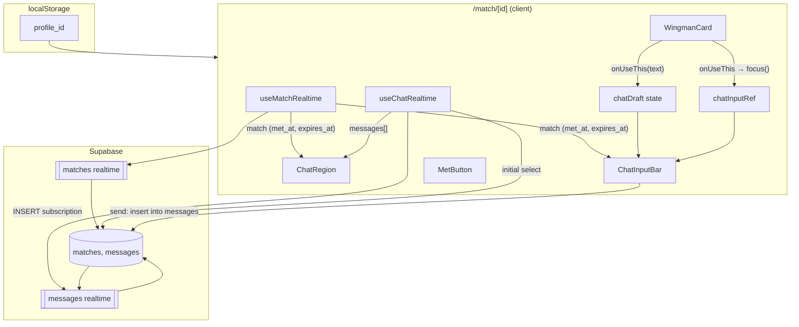

# Design Document: Match Chat

## Overview

The Match Chat feature adds realtime text chat to BARCHAT's hero match page (`/match/[id]`). It composes cleanly with the already-shipped AI Wingman feature: the chat draft seam left by Task 7.1 (`chatDraft` state on `Match_Page`, written by `WingmanCard.onUseThis`) is now wired to a real `ChatInputBar`, and a new `ChatRegion` is mounted between the wingman card and the sticky `Met_Button`.

All state is sourced from the existing `messages` table and Supabase realtime publication (BARCHAT.md sections 5 and 7) — no schema changes, no new tables, no new dependencies. A single new hook, `useChatRealtime`, mirrors the conventions of the existing `useMatchRealtime`: an initial `select … order by created_at asc` followed by an `INSERT`-only realtime subscription scoped to one `match_id`, with channel cleanup on unmount and graceful no-op when the `Supabase_Client` singleton is null.

The feature observes BARCHAT.md hard rules verbatim:
- No auth — `Current_User_Id` is read from `localStorage` under the existing check-in key.
- Mobile-first 390px viewport — every new component renders correctly inside `max-w-[390px]`.
- Tailwind only — no new CSS frameworks, no new state libraries.
- RLS disabled — the anon-key client writes directly to `messages`.
- No optimistic UI — sent messages appear via realtime only (Req 7.5), which keeps the rendered list a strict function of `messages` rows and avoids divergent client-only state.

The design is deliberately small. Almost all of the per-message logic is pure (alignment derivation, dedup, ordering, prefix rendering, disabled-state derivation), which is what makes property-based testing the right shape for this spec.

## Architecture



**Key flow properties:**

- The rendered message list is a *pure function of the `messages` rows* observed by `useChatRealtime`. There is no optimistic shadow list, no pending queue. Send issues a single `insert`; the new row arrives back through the same realtime path that delivers the other side's messages.
- The wingman draft seam is preserved exactly as the AI Wingman design specified: `WingmanCard.onUseThis(text)` writes to `chatDraft`. This spec only adds a focus side-effect on the chat input ref (Req 8.4) and removes the hidden `<span data-chat-draft>` placeholder that existed only to silence a lint warning.
- The disabled state of the chat input is *derived*, not stored. It is `met_at !== null || Date.parse(expires_at) <= Date.now()`. Because `useMatchRealtime` already merges `met_at` and `expires_at` from realtime UPDATEs, the input transitions to disabled within the same React render cycle that freezes the countdown.

## Components and Interfaces

### New: `app/match/[id]/useChatRealtime.ts`

Mirror of `useMatchRealtime`. Owns the messages array, the loading/error state, and the realtime channel lifecycle. Exposes a stable `messages` array and a `sendText` action so the page does not have to know about Supabase directly.

```typescript
"use client";
import { useState, useEffect, useRef, useCallback } from "react";
import { supabase } from "@/lib/supabase";
import type { RealtimeChannel } from "@supabase/supabase-js";

export type MessageKind = "text" | "system_drink";

export interface MessageRow {
  id: string;
  match_id: string;
  sender_id: string;
  kind: MessageKind;
  content: string;
  created_at: string; // ISO timestamp
}

export type ChatStatus = "loading" | "ready" | "fetch_error" | "unavailable";

export interface SendResult {
  ok: boolean;
  reason?: "unavailable" | "empty" | "insert_error";
}

export interface UseChatRealtimeResult {
  messages: MessageRow[];
  status: ChatStatus;
  sendError: string | null;       // last send-side error, cleared on next send attempt
  clearSendError: () => void;
  sendText: (
    rawDraft: string,
    senderId: string,
  ) => Promise<SendResult>;
}

export function useChatRealtime(matchId: string): UseChatRealtimeResult;
```

Implementation contract:

1. **Initial fetch (Req 2.1, 2.2).** On mount with a non-empty `matchId`, run `supabase.from("messages").select("*").eq("match_id", matchId).order("created_at", { ascending: true })`. On success, set `messages` to the returned rows and `status` to `"ready"`. On error, leave `messages` empty and set `status` to `"fetch_error"` (Req 2.4).
2. **Supabase null short-circuit (Req 2.3, 7.6).** If `supabase` is `null` at mount time, skip the fetch and the subscription, set `status` to `"unavailable"`, and leave `messages` empty.
3. **Subscription (Req 3.1).** Open a channel `chat-${matchId}` and listen for `postgres_changes` `INSERT` on `public.messages` filtered by `match_id=eq.${matchId}`.
4. **Insert handler (Req 3.2, 3.5).** On payload, append `payload.new` to `messages` *only if* no existing row has the same `id`. Always re-sort by `created_at` ascending (Req 3.3) — sorting is O(n log n) but `n` is bounded by the 15-minute timer, so this is trivially cheap.
5. **Cleanup (Req 3.4).** On unmount, call `supabase.removeChannel(channel)` and null the ref.
6. **Cancellation guard.** A `cancelled` flag prevents state writes after unmount, mirroring `useMatchRealtime`.
7. **`sendText` (Req 7.1, 7.2, 7.3, 7.4, 7.5, 7.6).**
   - If `supabase` is `null`, return `{ ok: false, reason: "unavailable" }` and *do not* clear the draft. The caller is responsible for *not* clearing the draft on this branch (see `Match_Page` send flow below).
   - Trim the draft with `String.prototype.trim()`. If the trimmed result is empty, return `{ ok: false, reason: "empty" }`. The caller is responsible for not clearing the draft.
   - Insert one row: `supabase.from("messages").insert({ match_id, sender_id, kind: "text", content: trimmed }).select("id").single()`. Use `.select("id").single()` so a successful response yields a deterministic primary key for retry deduplication (Req 7.4).
   - On error, set `sendError` to `"Couldn't send. Tap to retry."` and return `{ ok: false, reason: "insert_error" }`. Do *not* re-emit a row locally — the message either appears via realtime when the network heals or is genuinely lost; in either case, no duplicate insert is issued from this hook.
   - On success, leave `sendError` null and return `{ ok: true }`. The realtime subscription will deliver the new row back; the dedup-by-id rule (Req 3.5) ensures the row is rendered exactly once.

The hook intentionally does *not* clear the draft itself — draft ownership stays on `Match_Page` per the AI Wingman seam. The page calls `setChatDraft("")` in the moment after `sendText` is invoked but before awaiting it, so Req 7.2 (clear on initiation) is honored regardless of the eventual outcome of the insert.

### New: `app/match/[id]/ChatRegion.tsx`

Pure presentational component. Receives the messages array and renders it. No data access of its own.

```typescript
"use client";
import { forwardRef } from "react";
import type { MessageRow } from "./useChatRealtime";
import type { ChatStatus } from "./useChatRealtime";

export interface ChatRegionProps {
  messages: MessageRow[];
  status: ChatStatus;
  currentUserId: string;
  /** Inline error shown when the last send failed (Req 7.4). */
  sendError: string | null;
  /** Click handler attached to the inline error to allow retry. */
  onRetry?: () => void;
}

const ChatRegion = forwardRef<HTMLDivElement, ChatRegionProps>(
  function ChatRegion(props, ref) { /* ... */ },
);
export default ChatRegion;
```

Layout and rendering rules:

- Root: `flex-1 min-h-0 overflow-y-auto px-4 py-3 space-y-2`. The `min-h-0` is essential — without it the flex item refuses to shrink and the inner `overflow-y-auto` never engages, defeating Req 1.3 and Req 1.4.
- The forwarded ref points at the scroll container so `Match_Page` can drive auto-scroll (Req 9).
- **Empty state (Req 1.5).** When `messages.length === 0` AND `status !== "fetch_error"`, render a single centered placeholder with the literal text `Say hi`.
- **Fetch error (Req 2.4).** When `status === "fetch_error"`, render a single centered inline error with the literal text `Couldn't load messages` instead of the placeholder.
- **Unavailable (Req 2.3).** When `status === "unavailable"`, render the empty-state placeholder (`Say hi`) — Req 2.3 explicitly requires this branch to use the placeholder, not the error string.
- **Send error (Req 7.4).** When `sendError` is non-null, render an inline `<button>` styled as an error pill with the literal text `Couldn't send. Tap to retry.`, anchored at the *bottom* of the message list (just above the auto-scroll target). Activating it calls `onRetry?.()`.
- **Message rendering.** Iterates `messages` in array order (already sorted by `created_at` ascending) and dispatches by `kind`:
  - `kind === "text"` → `<MessageBubble />`
  - `kind === "system_drink"` → `<SystemDrinkRow />`

### New: `app/match/[id]/MessageBubble.tsx`

Renders a single text message. Pure function of its props.

```typescript
export interface MessageBubbleProps {
  content: string;
  isOwn: boolean; // sender_id === currentUserId
}

export default function MessageBubble(props: MessageBubbleProps): JSX.Element;
```

Visual contract:

- Outer wrapper: `flex w-full` plus `justify-end` when `isOwn`, `justify-start` when not (Req 4.1, 4.2).
- Bubble: `max-w-[80%] rounded-2xl px-3 py-2 text-sm leading-snug whitespace-pre-wrap break-words` (Req 4.4 width cap, Req 4.5 newline preservation via `whitespace-pre-wrap`, Req 4.4 long-word wrapping via `break-words`).
- Color tokens (consistent with the rest of the page):
  - Own: `bg-pink-600/80 text-white border border-pink-400/20`
  - Other: `bg-white/10 text-white border border-white/10`
- Content rendered as a child text node (no `dangerouslySetInnerHTML`). React's default escaping suffices — the `content` field is a `text` column with no markup contract.

### New: `app/match/[id]/SystemDrinkRow.tsx`

Renders a `system_drink` message. Always centered, always full-width, never side-aligned (Req 5.1, 5.3).

```typescript
export interface SystemDrinkRowProps {
  content: string;
}

export default function SystemDrinkRow(props: SystemDrinkRowProps): JSX.Element;
```

Visual contract:

- Outer wrapper: `flex w-full justify-center`.
- Inner pill: `w-full text-center text-xs text-white/60 italic px-3 py-2 rounded-xl bg-white/5 border border-white/10`.
- Visible text: the literal string `"🍺 "` followed by `props.content` (Req 5.2). The prefix is intentionally a constant in the component, not a database concern — `messages.content` for `system_drink` rows stores only the human-readable body (e.g. "Mai sent you a 🍺 Beer ฿120"), per BARCHAT.md section 9.

### New: `app/match/[id]/ChatInputBar.tsx`

Sticky-by-layout chat input. Owns the `<input>` element and the visible send button. Pure controlled component — no internal state for the draft.

```typescript
"use client";
import { forwardRef } from "react";

export interface ChatInputBarProps {
  value: string;
  onChange: (next: string) => void;
  onSend: () => void;
  disabled: boolean; // (Req 6.5)
}

const ChatInputBar = forwardRef<HTMLInputElement, ChatInputBarProps>(
  function ChatInputBar(props, ref) { /* ... */ },
);
export default ChatInputBar;
```

Layout and behavior:

- Wrapper: `flex items-center gap-2 px-4 py-3 border-t border-white/10 bg-black/80 backdrop-blur-sm`.
- Input: `flex-1 min-w-0 rounded-2xl px-3 py-2 bg-white/10 border border-white/10 text-white placeholder-white/40 outline-none disabled:opacity-50 disabled:cursor-not-allowed`. `value={value}`, `onChange={(e) => onChange(e.target.value)}` (Req 6.2, 6.3). `disabled={disabled}` (Req 6.5).
- The input's `onKeyDown` handler invokes `onSend()` when the key is `Enter` and `event.shiftKey` is false (Req 7.1 send-key contract).
- Send button: `<button type="button">` with `disabled={disabled || value.trim().length === 0}` and `onClick={onSend}`. Visible label is "Send" (Req 6.1, 6.5).
- The forwarded ref points at the underlying `<input>` so `Match_Page` can call `.focus()` from the wingman handler (Req 8.4).

### Modified: `app/match/[id]/page.tsx`

Three structural changes plus a layout refactor.

**Layout refactor.** Today the page is `min-h-screen flex flex-col` with the timer expanded by `flex-1` and a `pb-24` spacer for the fixed `MetButton`. Without bounding the page height, the chat region cannot scroll independently. The page becomes:

```
<main class="h-[100dvh] flex flex-col max-w-[390px] mx-auto bg-gray-950 pb-[6rem]">
  ProfileHeader              // natural height
  CountdownTimer             // natural height (no flex-1 wrapper)
  WingmanCard                // natural height
  ChatRegion                 // flex-1 min-h-0 overflow-y-auto
  ChatInputBar               // natural height; pinned visually because chat above scrolls
</main>
<MetButton ... />            // unchanged: still fixed at the viewport bottom
```

Why this works for Req 1.3 and Req 1.4:
- `h-[100dvh]` bounds the column. Without a hard ceiling, `flex-1 min-h-0` cannot constrain the chat region.
- `min-h-0` releases the default `min-height: auto` on the chat region so it shrinks to fit and overflows internally.
- `pb-[6rem]` matches the MetButton's painted height (full-width button + `p-4 pb-[max(1rem,env(safe-area-inset-bottom))]`) so the `ChatInputBar`'s bottom edge sits flush above the fixed MetButton, not behind it. (Req 1.4: MetButton remains visible; chat input remains visible above it.)
- The previous timer-centering effect (`flex-1 flex items-center justify-center`) is dropped. The countdown is the visual centerpiece anchored toward the top of the screen rather than mathematically centered, which fits the chat-heavy layout better and matches BARCHAT.md section 9's top-to-bottom ordering.

**State additions.**

```typescript
const [chatDraft, setChatDraft] = useState<string>(""); // was string | null in ai-wingman
const chatInputRef = useRef<HTMLInputElement>(null);
const chatScrollRef = useRef<HTMLDivElement>(null);
const currentUserId = useReadProfileId(); // small helper that returns localStorage profile_id or ""
const {
  messages, status: chatStatus, sendError, clearSendError, sendText,
} = useChatRealtime(matchId);
```

The change of `chatDraft` from `string | null` to `string` is intentional. The previous spec used `null` as a sentinel for "untouched", but with a real input `""` is the natural empty state, and `null` causes a type mismatch with the controlled-component contract.

**Disabled-state derivation (Req 6.5).**

```typescript
const matchEnded =
  match.met_at !== null ||
  Date.parse(match.expires_at) <= Date.now();
```

This is recomputed on every render. The expired branch flips correctly on the same `setInterval` tick that drives the countdown's re-render — `CountdownTimer`'s tick already triggers a parent state change indirectly only through realtime, so to make Req 6.5 robust against the user idling on the page through `expires_at`, `Match_Page` adds a lightweight 1-second tick (`useState(Date.now())` + `setInterval`) when `match.met_at` is null and `expires_at > now`, and stops ticking once either condition flips. This is the same pattern `CountdownTimer` already uses internally; it stays a private detail of the page.

**Send flow (Req 7.1–7.5).**

```typescript
const handleSend = useCallback(async () => {
  if (matchEnded) return;
  const draft = chatDraft;
  // Req 7.3: empty / whitespace draft is a no-op, draft preserved.
  if (draft.trim().length === 0) return;
  // Req 7.2: clear draft when the insert is *initiated*, not after it resolves.
  setChatDraft("");
  // Req 7.5: no optimistic render. The realtime path (Req 3.2) is the only render source.
  const result = await sendText(draft, currentUserId);
  if (!result.ok && result.reason === "unavailable") {
    // Req 7.6: client unavailable → restore the draft and surface the error.
    setChatDraft(draft);
  }
  // For "insert_error", the hook has already set sendError; the inline retry
  // pill in ChatRegion (Req 7.4) lets the user re-attempt without duplication.
  // For "empty", we never reach here (handled above).
}, [chatDraft, sendText, currentUserId, matchEnded]);
```

Two ordering nuances worth calling out:

1. *Why clear the draft before awaiting?* Req 7.2 says "WHEN the insert request is initiated, THE Match_Page SHALL clear `Chat_Draft`." Synchronous clearing also makes the input feel responsive on slow networks.
2. *Why restore the draft on `"unavailable"` only?* Req 7.6 forbids modifying `Chat_Draft` when the client is null. Without the restore, the synchronous clear in step 1 would violate that requirement. For the `"insert_error"` path Req 7.4 does *not* require restoring the draft; the user retries via the error pill, which re-attempts the original (un-cleared, but the draft *was* cleared — see the retry handling below).

**Retry handling.** The error pill (`onRetry`) re-attempts the insert with the *previous* draft. To support this, the hook keeps the last-attempted trimmed string in a private ref and `clearSendError` either succeeds via a fresh attempt (driven by the page) or is a no-op. Concretely the page binds:

```typescript
<ChatRegion
  ...
  onRetry={async () => {
    clearSendError();
    // The hook's last attempted content is what gets re-inserted.
    const result = await sendText(/* last attempted draft */, currentUserId);
    // If retry succeeds, dedup-by-id (Req 3.5) handles any duplicate realtime delivery.
  }}
/>
```

Implementations may choose to keep the last attempted content inside the hook (returned as part of the result envelope) or as a private state slot on the page; both satisfy Req 7.4's "SHALL NOT persist a duplicate row on a subsequent retry" because *each retry re-issues a fresh insert with a server-generated UUID*. Duplicate rows can only occur if the page issues two inserts for the same logical send, which the design prevents by guarding retries on `sendError !== null`.

**`onUseThis` wire-up (Req 8.1, 8.4).** `WingmanCard.onUseThis` becomes:

```typescript
const handleUseThis = useCallback((text: string) => {
  setChatDraft(text);                           // Req 8.1, 8.2
  if (chatInputRef.current && !matchEnded) {    // Req 8.4 (only when input rendered and enabled)
    chatInputRef.current.focus();
  }
  // Req 8.3: no insert, no send call. setChatDraft above is the only side-effect.
}, [matchEnded]);
```

The hidden `<span data-chat-draft>` placeholder added in the AI Wingman task is removed — `chatDraft` is now genuinely consumed as `ChatInputBar`'s `value`.

**Auto-scroll (Req 9).**

```typescript
useEffect(() => {
  // Req 9.1, 9.2, 9.3: scroll to the bottom on every length change.
  // Using scrollHeight as the target works for both initial mount (n>0) and
  // every subsequent insert. When n=0 there is nothing to scroll to and the
  // assignment is a no-op.
  const node = chatScrollRef.current;
  if (!node) return;
  node.scrollTop = node.scrollHeight;
}, [messages.length]);
```

Triggering on `messages.length` rather than `messages` itself prevents scrolling on no-op state writes (defensive, but cheap). Initial fetch arriving with `n>0` rows triggers the effect once, satisfying Req 9.2; subsequent realtime inserts trigger it once each, satisfying Req 9.1 and Req 9.3 (which doesn't distinguish own vs other vs system_drink — auto-scroll runs for all kinds).

The effect intentionally does *not* honor a "user has scrolled up" mode. The 15-minute demo bound makes scroll-to-bottom the right default; supporting "stay where I am while reading" would require tracking the scroll offset and is out of scope (see Out-of-Scope in requirements.md).

### Modified: `app/match/[id]/WingmanCard.tsx`

No interface change. The component already exposes `onUseThis(text: string) => void` and is already invoked by `Match_Page`. Behavior preserved as-is — focus management is owned by the parent (Req 8.4).

### Unchanged: `app/match/[id]/MetButton.tsx`

The component remains `fixed` at the bottom of the viewport. Sustaining its existing API is preferred over a refactor — the chat layout's `pb-[6rem]` padding clears the fixed band, which is the smallest change consistent with Req 1.4.

## Data Models

### `MessageRow`

Mirrors the `messages` table schema verbatim. No client-only fields.

```typescript
export type MessageKind = "text" | "system_drink";

export interface MessageRow {
  id: string;          // uuid, server-generated
  match_id: string;    // uuid
  sender_id: string;   // uuid
  kind: MessageKind;
  content: string;     // not null
  created_at: string;  // ISO timestamp
}
```

### Realtime payload

The Supabase JS client surfaces `INSERT` events as `{ new: Row, old: {} }`. The hook reads only `payload.new` and treats it as a `MessageRow`.

### Chat hook state machine

```mermaid
stateDiagram-v2
    [*] --> Loading : mount, supabase != null
    [*] --> Unavailable : mount, supabase == null
    Loading --> Ready : initial select ok
    Loading --> FetchError : initial select error
    Ready --> Ready : realtime INSERT (dedup by id)
    Ready --> Ready : sendText() success
    Ready --> Ready : sendText() insert_error\n(sets sendError; messages unchanged)
    FetchError --> [*] : unmount
    Ready --> [*] : unmount
    Unavailable --> [*] : unmount
```



### Match-page derived state

```typescript
type MatchEnded = boolean; // = match.met_at !== null || Date.parse(match.expires_at) <= now
type ChatInputDisabled = MatchEnded; // identity (Req 6.5)
type SendButtonEnabled = !MatchEnded && chatDraft.trim().length > 0;
```

### Visual rendering decision table

| Row kind | `sender_id === currentUserId` | Wrapper alignment | Bubble style | Visible content prefix |
|---|---|---|---|---|
| `text` | true | right (Req 4.1) | own pink bubble | none |
| `text` | false | left (Req 4.2) | other gray bubble | none |
| `system_drink` | true | center, full-width (Req 5.1) | drink pill | `"🍺 "` (Req 5.2) |
| `system_drink` | false | center, full-width (Req 5.1) | drink pill | `"🍺 "` (Req 5.2) |


## Correctness Properties

*A property is a characteristic or behavior that should hold true across all valid executions of a system — essentially, a formal statement about what the system should do. Properties serve as the bridge between human-readable specifications and machine-verifiable correctness guarantees.*

(See `prework` analysis for the testability classification of each acceptance criterion. The properties below are the consolidated set after redundancy reflection: 22 acceptance criteria collapsed into 9 universally-quantified properties; layout/visual/lifecycle criteria are tested as targeted examples or snapshots, see Testing Strategy.)

### Property 1: Empty-state placeholder appears iff there are no messages

*For any* `MessageRow[]` `xs` and any `ChatStatus` `s` such that `s !== "fetch_error"`, rendering `<ChatRegion messages={xs} status={s} ...>`:
- when `xs.length === 0`, the visible `textContent` of the chat region SHALL contain the literal substring `"Say hi"` AND SHALL NOT contain any character from any element of `xs`;
- when `xs.length > 0`, the visible `textContent` SHALL NOT contain the literal substring `"Say hi"`.

**Validates: Requirements 1.5, 2.3**

### Property 2: Rendered messages are sorted by `created_at` ascending

*For any* sequence of "delivery events" `events` — where each event is either an *initial-fetch* with an array of `MessageRow` or a *realtime-insert* with a single `MessageRow` — applying the events in order to a freshly-mounted `useChatRealtime` SHALL produce a final `messages` array that is non-strictly increasing in `created_at` AND whose set of `id`s equals the set of unique `id`s across all events.

**Validates: Requirements 2.2, 3.3, 5.4**

### Property 3: Realtime delivery is deduplicated by `id`

*For any* initial fetch result `xs: MessageRow[]` and any realtime insert sequence `ys: MessageRow[]` (where `ys` may include `id`s that also appear in `xs` and `id`s that repeat within `ys` itself), applying both through `useChatRealtime` SHALL produce a `messages` array whose `id`s form a set (no duplicates) AND whose `id` set equals `setOf(xs.map(id)) ∪ setOf(ys.map(id))`.

**Validates: Requirements 3.2, 3.5**

### Property 4: Text-message rendering is a pure function of sender identity and content

*For any* `MessageRow` `m` with `m.kind === "text"` and any `currentUserId: string`, rendering `<MessageBubble content={m.content} isOwn={m.sender_id === currentUserId} />`:
- when `m.sender_id === currentUserId`, the bubble's outer wrapper SHALL carry a right-alignment marker AND SHALL NOT carry a left-alignment marker;
- when `m.sender_id !== currentUserId`, the bubble's outer wrapper SHALL carry a left-alignment marker AND SHALL NOT carry a right-alignment marker;
- the rendered text node `textContent` SHALL equal `m.content` exactly (verbatim, including all newline characters);
- the bubble element SHALL carry the `whitespace-pre-wrap` class so that any newlines in `m.content` survive layout.

**Validates: Requirements 4.1, 4.2, 4.3, 4.5**

### Property 5: System-drink rendering is centered, full-width, and beer-prefixed

*For any* `MessageRow` `m` with `m.kind === "system_drink"` and any `currentUserId: string`, rendering the row in `<ChatRegion>`:
- the row's outer wrapper SHALL carry a center-alignment marker AND SHALL NOT carry either a left- or right-alignment marker;
- the row's visible `textContent` SHALL equal the string `"🍺 " + m.content` exactly (the literal beer-emoji-plus-space prefix immediately followed by the content);
- these properties SHALL hold regardless of whether `m.sender_id === currentUserId`.

**Validates: Requirements 5.1, 5.2, 5.3**

### Property 6: Chat input is a controlled-component identity over `chatDraft`

*For any* string `s`, mounting `<ChatInputBar value={s} onChange={onChange} ... />` SHALL produce an `<input>` whose `.value` is byte-equal to `s`. *For any* sequence of user `change` events delivering values `[v1, v2, …, vk]`, after each event the most recent value passed to `onChange` SHALL equal the corresponding `vi`.

**Validates: Requirements 6.2, 6.3, 8.2**

### Property 7: Disabled state is exactly the match-ended derivation

*For any* `match.met_at: string | null`, `match.expires_at: string` (ISO timestamp), and `now: number` (epoch ms), the `disabled` prop passed to `<ChatInputBar>` and the `disabled` attribute of the visible send button SHALL both equal `match.met_at !== null || Date.parse(match.expires_at) <= now`.

**Validates: Requirements 6.5**

### Property 8: Send semantics

*For any* `chatDraft: string`, `currentUserId: string`, and `matchId: string`, performing a `Chat_Send_Action` while `Supabase_Client` is non-null and the match has not ended SHALL behave as follows:

- if `chatDraft.trim().length === 0`, no `insert` call is issued AND `chatDraft` is unchanged after the action;
- if `chatDraft.trim().length > 0`, exactly one `insert` call is issued with payload `{ match_id: matchId, sender_id: currentUserId, kind: "text", content: chatDraft.trim() }`, AND immediately following the call `chatDraft` equals the empty string, AND no `MessageRow` is appended to the rendered `messages` array as a synchronous result of the action (any new row arrives only via the realtime path).

**Validates: Requirements 7.1, 7.2, 7.3, 7.5**

### Property 9: "Use this" sets draft and auto-scroll fires on growth

*For any* non-empty string `text`, invoking `Wingman_Card.onUseThis(text)` while the page is mounted SHALL set `chatDraft` to `text` AND SHALL NOT issue any `insert` call. Independently, *for any* messages-array length transition `n → n + k` with `k ≥ 1` (covering both the initial-fetch transition `0 → n` and any realtime-driven `n → n + 1`), the chat-region scroll container's `scrollTop` after the React commit SHALL equal its `scrollHeight`, regardless of whether the new rows are own/other or text/system_drink.

**Validates: Requirements 8.1, 8.3, 9.1, 9.2, 9.3**

## Error Handling

The following matrix enumerates every observable error/edge condition the design must handle. "Render path" describes what the user sees; "State path" describes what changes in client state.

| Scenario | Trigger | Render path | State path | Notes |
|---|---|---|---|---|
| Supabase client is null at mount | `lib/supabase.ts` exports `null` (env vars missing) | `ChatRegion` shows the `"Say hi"` placeholder; no input fetch issued | `chatStatus = "unavailable"`; `messages = []` | Req 2.3, 7.6 |
| Initial fetch errors | `supabase.from("messages").select(...)` returns `{ error }` | `ChatRegion` shows inline `"Couldn't load messages"` | `chatStatus = "fetch_error"`; `messages = []` | Req 2.4 |
| Initial fetch returns empty array | Network ok, table has no rows for this match | `ChatRegion` shows `"Say hi"` placeholder | `chatStatus = "ready"`; `messages = []` | Req 1.5 |
| Realtime delivers a row whose `id` is already rendered | Same row from initial fetch and from `INSERT` payload | Row rendered exactly once | `messages` unchanged on the duplicate event | Req 3.5 |
| Realtime delivers an out-of-order row | Network jitter; payload `created_at` predates an existing row | Row inserted at the correct sorted position | `messages` re-sorted by `created_at` ascending | Req 3.3 |
| Realtime channel disconnect | Network drop | Existing rendered messages remain visible; no new rows arrive until reconnect | No state change on disconnect | The Supabase client retries automatically; out of scope to expose a "disconnected" UI for the 15-min demo |
| Send while client is null | `supabase === null`, user presses Enter or Send | Inline `"Couldn't send. Tap to retry."` appears in `ChatRegion`; no insert issued | `chatDraft` unchanged | Req 7.6 |
| Send while match has ended | `met_at !== null` or `expires_at <= now` | Send button is disabled; key handler is no-op | `chatDraft` unchanged | Req 6.5 — defensive: the page also short-circuits in `handleSend` |
| Send with empty/whitespace-only draft | `chatDraft.trim() === ""` | Send button is disabled (visual hint); key handler is no-op | `chatDraft` unchanged | Req 7.3 |
| Send with multi-line content | `chatDraft` contains `\n` after trim | One insert with `content = chatDraft.trim()`; rendered bubble preserves line breaks | `chatDraft = ""` | Req 4.5, 7.1 |
| Send insert errors | `supabase.from("messages").insert(...)` returns `{ error }` | Inline `"Couldn't send. Tap to retry."` appears in `ChatRegion`, anchored at bottom of message list | `chatDraft = ""` (already cleared on initiation per Req 7.2); `sendError` set | Req 7.4 — retry re-attempts a fresh insert, never duplicates an already-persisted row |
| Retry after transient send failure | User taps the error pill | New `insert` call issued with the previously-attempted content | `sendError` cleared on attempt; on success, the realtime path delivers the new row | Req 7.4: the page guards retry on `sendError !== null` so only one insert is issued per logical send |
| `onUseThis` invoked with empty string | `WingmanCard` would not pass an empty string per its existing guard, but defensively | No state change | `chatDraft` unchanged | Req 8.1 only triggers when icebreaker is non-empty; consistent with `WingmanCard.handleClick` guard |
| `onUseThis` invoked while input is disabled | Match has ended after the wingman card became Ready | `chatDraft` is updated; focus is **not** moved | `chatDraft = text` | Req 8.4: focus only moves when the input is rendered and not disabled |
| Page mounts via deep link with no localStorage `profile_id` | `currentUserId === ""` | All messages render as "other" (left-aligned text bubbles); user can still read but `Send` issues an insert with `sender_id = ""` which the DB will reject because of the FK | Inline send error if user attempts to send | Out of scope to handle gracefully; the existing check-in flow guarantees `profile_id` exists when the user reaches this page legitimately |

## Testing Strategy

### When PBT applies

PBT fits this feature in narrow but high-value places:

- **Pure rendering functions** — `MessageBubble` and `SystemDrinkRow` are deterministic functions of their props, with wide input spaces (any string, any `isOwn` boolean, any `kind`). Property tests catch escape/encoding/alignment regressions across the input space.
- **Pure list-merge logic** — the dedup-by-id and sort-by-`created_at` semantics in `useChatRealtime` are pure functions over message arrays; ideal for property-based testing with random insert sequences.
- **Pure derivation** — the disabled-state predicate (`met_at !== null || expires_at_ms <= now`) is a three-input pure function; property tests with random clock values verify the boundary at `expires_at_ms === now`.
- **Pure send-action logic** — given a draft and a mocked `insert`, the page's `handleSend` is testable as a property: trim, conditional insert, conditional clear.

PBT is NOT appropriate for:

- The realtime channel lifecycle itself (`subscribe`, `removeChannel`) — these are wiring assertions; one example test each is sufficient (Req 3.1, 3.4).
- The 390px viewport rendering — visual correctness is verified via snapshot tests and the demo dry-run (Req 1.2, 6.4).
- The DOM ordering of top-level page elements (Req 1.1, 6.1) — single integration test asserting the order is enough.
- Auto-scroll in jsdom — `scrollHeight` requires layout, which jsdom doesn't run; property-test with a stubbed element whose `scrollHeight` is set explicitly, or verify in Playwright.

### Library and configuration

- Library: **`fast-check`** (TypeScript), matching the AI Wingman spec's choice.
- Test runner: whichever the implementation tasks select (Jest or Vitest); no constraint imposed here. The AI Wingman spec is silent on runner; this spec inherits that flexibility.
- Minimum **100 iterations** per property test (`fc.assert(prop, { numRuns: 100 })`).
- Each property test annotated with a comment of the form:
  ```
  // Feature: match-chat, Property N: <property text>
  ```
- Random message generators (used across multiple properties) live in a single `app/match/[id]/__tests__/generators.ts` so that one fix to a generator (e.g. valid uuid shape) propagates to every property.

### Generator design

A small set of `fc.Arbitrary` generators is shared across the property suite:

- `arbUuid()` — `fc.uuidV(4)`.
- `arbContent()` — `fc.string({ minLength: 1, maxLength: 280 })` with a `oneof` mix-in for strings containing `\n` (covers Req 4.5) and strings of pure whitespace (covers Req 7.3).
- `arbCreatedAt()` — `fc.integer({ min: 1700000000000, max: 1900000000000 }).map((n) => new Date(n).toISOString())`.
- `arbKind()` — `fc.constantFrom("text", "system_drink")`.
- `arbMessageRow(matchId, possibleSenders)` — composes the above into a `MessageRow` whose `match_id` is fixed and `sender_id` is sampled from the two-element `possibleSenders` array (so that own/other ratio is non-trivial).
- `arbDeliveryEventSequence()` — `fc.array(arbDeliveryEvent, { minLength: 0, maxLength: 30 })` where each event is either an initial-fetch array or a single insert; used by Property 2 and Property 3.

### Test plan

| # | Test | Type | Target | Notes |
|---|---|---|---|---|
| 1 | Empty-state vs non-empty | property | Property 1 | Generates random `MessageRow[]` and asserts the `"Say hi"` invariant. 100 runs. |
| 2 | Rendered order is `created_at` ascending | property | Property 2 | Replays random delivery sequences; asserts non-strictly increasing `created_at`. 100 runs. |
| 3 | Dedup by id | property | Property 3 | Random `(xs, ys)` with arbitrary id overlap; asserts rendered id set equals union and has no duplicates. 100 runs. |
| 4 | Text alignment + content fidelity | property | Property 4 | Random text rows + currentUserId; asserts wrapper alignment marker AND verbatim `textContent` AND `whitespace-pre-wrap` class. 100 runs. |
| 5 | System-drink rendering | property | Property 5 | Random system_drink rows; asserts center alignment + literal `"🍺 "` prefix. 100 runs. |
| 6 | Controlled-input identity | property | Property 6 | Random strings + random change-event sequences; asserts input value tracks chatDraft and onChange writes back. 100 runs. |
| 7 | Disabled-state derivation | property | Property 7 | Random `(met_at, expires_at, now)` triples; asserts `disabled` equals the boolean expression. 100 runs. Uses `fc.pre` to exclude the boundary `expires_at_ms === now` from one branch and explicitly tests both sides of it as fixed examples. |
| 8 | Send semantics | property | Property 8 | Mocks supabase `insert`; random drafts including empty/whitespace/multi-line; asserts insert call count, payload, and post-state of `chatDraft`. 100 runs. |
| 9 | Use-this and auto-scroll | property | Property 9 | Two sub-properties under one test file: (a) `onUseThis(text)` sets `chatDraft = text` and issues no insert; (b) every length increase sets `scrollTop = scrollHeight` on the (stubbed) ref. 100 runs. |
| 10 | DOM order on the page | example | Req 1.1, 6.1 | Render `Match_Page`; assert `ProfileHeader → Countdown → WingmanCard → ChatRegion → ChatInputBar` order in `document.body`. |
| 11 | Mobile viewport snapshot | snapshot | Req 1.2, 6.4 | jest-image-snapshot or Playwright at 390px. |
| 12 | Sticky `MetButton` stays visible with overflowing chat | integration | Req 1.4 | Playwright at 390x844; seed 50 messages; assert `MetButton.boundingBox.bottom <= viewport.height`. |
| 13 | Initial fetch issues correct query | example | Req 2.1 | Mock supabase chain; mount; assert `from("messages").select("*").eq("match_id", id).order("created_at", { ascending: true })` was called once. |
| 14 | Initial fetch error renders error string | example | Req 2.4 | Mock select to return `{ error: ... }`; assert `"Couldn't load messages"` in `ChatRegion`. |
| 15 | Realtime channel opened with right filter | example | Req 3.1 | Spy on `supabase.channel().on()`; assert `filter: "match_id=eq.${id}"`, `event: "INSERT"`, `schema: "public"`, `table: "messages"`. |
| 16 | Channel removed on unmount | example | Req 3.4 | Mount + unmount; assert `supabase.removeChannel(channel)` called exactly once. |
| 17 | Send-error pill text | example | Req 7.4 | Mock insert to reject; trigger send; assert `"Couldn't send. Tap to retry."` rendered. |
| 18 | Retry after error issues exactly one new insert | example | Req 7.4 | After (17), tap the error pill; assert insert called twice total (once original, once retry); `sendError` cleared on retry attempt. |
| 19 | Send while client null | example | Req 7.6 | Mock supabase as null; trigger send with non-empty draft; assert error rendered AND `chatDraft` unchanged. |
| 20 | Focus moves on use-this when not disabled | example | Req 8.4 | Render with active match; invoke `onUseThis("hi")`; assert `document.activeElement === input`. With ended match, assert focus did NOT move to the input. |
| 21 | End-to-end: sender → other receives message | integration | Req 3.2, 4.1, 4.2, 9.1 | Open two browser contexts, perform a check-in for each, share a match id, send from A, assert B's chat region renders the row right-after-realtime within 2 seconds, and B's chat scrolls to bottom. |

### Test placement and naming

- Property tests + generators: `app/match/[id]/__tests__/match-chat.property.test.ts(x)` and `app/match/[id]/__tests__/generators.ts`.
- Component example tests: colocated as `MessageBubble.test.tsx`, `SystemDrinkRow.test.tsx`, `ChatRegion.test.tsx`, `ChatInputBar.test.tsx` under `app/match/[id]/__tests__/`.
- Hook example tests: `useChatRealtime.test.ts` under `app/match/[id]/__tests__/`.
- Page integration tests: `page.test.tsx` under `app/match/[id]/__tests__/`.
- Playwright integration: `e2e/match-chat.spec.ts` (one file, scenarios 12 and 21).

### Out-of-scope verification

- Optimistic UI for sent messages (Req 7.5 explicitly forbids it; tested as a property, not a feature).
- Pagination, infinite scroll, message-history limits.
- Read receipts, typing indicators, reactions.
- "User has scrolled up — don't yank to bottom" mode.
- Any insert path for `system_drink` rows (BARCHAT.md Task 8).
