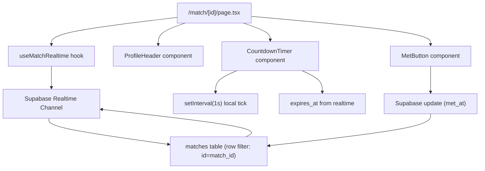
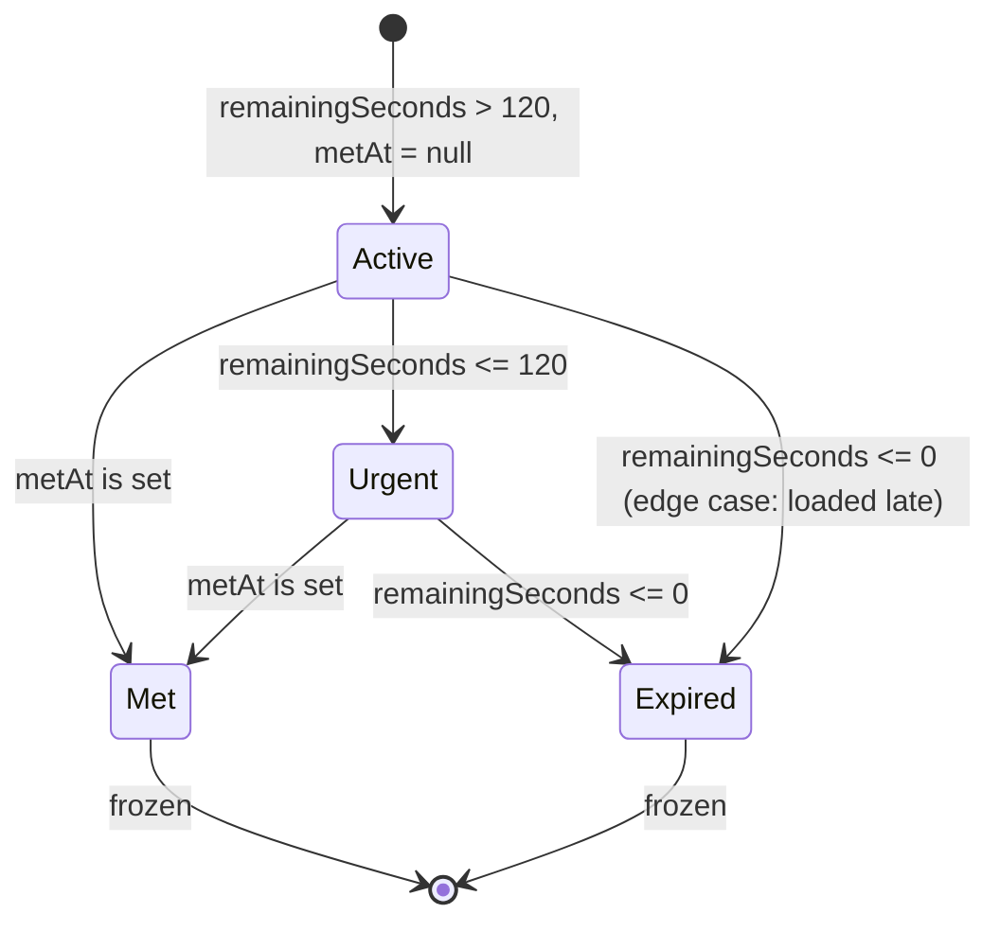

# Design Document: Match Page Hero Timer

## Overview

The Match Page Hero Timer is a Next.js 14 App Router page at `/match/[id]` that serves as BARCHAT's emotional centerpiece. It renders a dramatic countdown timer synced in realtime between two matched users via Supabase realtime subscriptions.

The page is a single client component (`"use client"`) that:
1. Fetches the match row and both profiles on mount
2. Subscribes to realtime changes on the match row
3. Computes and displays a locally-ticking MM:SS countdown
4. Provides a sticky "I met them" button to confirm an in-person meeting

The design prioritizes simplicity — no state management library, no server components for the interactive parts, and direct Supabase client usage matching the existing project patterns.

## Architecture



**Data flow:**
1. Page mounts → fetches match + profiles → subscribes to realtime
2. Realtime delivers `expires_at` and `met_at` as authoritative values
3. Local `setInterval(1s)` decrements displayed seconds for smooth UX
4. "I met them" tap → Supabase update → realtime propagates to both clients

## Components and Interfaces

### Page Component: `app/match/[id]/page.tsx`

The top-level client component. Uses `useParams()` to get the match ID, orchestrates data fetching, and renders child components.

```typescript
// app/match/[id]/page.tsx
"use client";

interface MatchPageProps {
  params: { id: string };
}

interface MatchData {
  id: string;
  profile_a: string;
  profile_b: string;
  venue_id: string;
  created_at: string;
  expires_at: string;
  met_at: string | null;
  icebreaker: string | null;
  icebreaker_tip: string | null;
}

interface ProfileData {
  id: string;
  display_name: string;
  age: number | null;
  photo_url: string | null;
  bio: string | null;
  is_verified_patron: boolean;
}

interface PresenceData {
  profile_id: string;
  venue_id: string;
  intent: string;
}
```

### Hook: `useMatchRealtime`

Custom hook encapsulating the Supabase realtime subscription logic.

```typescript
function useMatchRealtime(matchId: string): {
  match: MatchData | null;
  loading: boolean;
  error: string | null;
}
```

- Subscribes to `postgres_changes` on the `matches` table filtered by `id = matchId`
- On `UPDATE` events, merges new `expires_at` and `met_at` into local state
- Cleans up subscription on unmount via `useEffect` cleanup

### Component: `ProfileHeader`

```typescript
interface ProfileHeaderProps {
  profileA: ProfileData;
  profileB: ProfileData;
  intentA: string;
  intentB: string;
}
```

Renders two profile cards side by side with:
- Circular photo (with fallback avatar)
- Display name
- Verified checkmark (✓ badge) if `is_verified_patron`
- Intent badge with color coding

### Component: `CountdownTimer`

```typescript
interface CountdownTimerProps {
  expiresAt: string;   // ISO timestamp
  metAt: string | null; // ISO timestamp or null
}
```

Internal state:
- `remainingSeconds`: number, decremented by local interval
- `timerState`: `'active' | 'urgent' | 'met' | 'expired'`

Logic:
- On mount and when `expiresAt` changes: recalculate `remainingSeconds = Math.max(0, Math.floor((new Date(expiresAt).getTime() - Date.now()) / 1000))`
- `setInterval(1s)` decrements `remainingSeconds` while state is `active` or `urgent`
- When `metAt` becomes non-null: freeze (clear interval), set state to `'met'`
- When `remainingSeconds <= 0` and `metAt` is null: set state to `'expired'`
- When `remainingSeconds <= 120` and `metAt` is null: set state to `'urgent'`

### Component: `MetButton`

```typescript
interface MetButtonProps {
  matchId: string;
  metAt: string | null;
  expired: boolean;
}
```

- Renders a sticky bottom bar with the "I met them ✨" button
- Hidden when `metAt` is set or `expired` is true
- On tap: calls `supabase.from('matches').update({ met_at: new Date().toISOString() }).eq('id', matchId)`

### Utility: `formatTime`

```typescript
function formatTime(seconds: number): string
```

Converts a non-negative integer of seconds into `MM:SS` format. Clamps negative values to `"00:00"`.

## Data Models

### Match Row (from Supabase)

| Field | Type | Description |
|-------|------|-------------|
| `id` | uuid | Primary key |
| `profile_a` | uuid | FK to profiles |
| `profile_b` | uuid | FK to profiles |
| `venue_id` | uuid | FK to venues |
| `created_at` | timestamptz | When match was created |
| `expires_at` | timestamptz | `created_at + 15 minutes` |
| `met_at` | timestamptz \| null | Set when either user taps "I met them" |
| `icebreaker` | text \| null | AI-generated icebreaker (out of scope for this feature) |
| `icebreaker_tip` | text \| null | AI-generated tip (out of scope for this feature) |

### Profile Row (from Supabase)

| Field | Type | Description |
|-------|------|-------------|
| `id` | uuid | Primary key |
| `display_name` | text | User's chosen name |
| `age` | int \| null | User's age |
| `photo_url` | text \| null | URL to profile photo |
| `bio` | text \| null | Short bio |
| `is_verified_patron` | boolean | Whether venue has verified this user |

### Presence Row (from Supabase)

| Field | Type | Description |
|-------|------|-------------|
| `profile_id` | uuid | FK to profiles |
| `venue_id` | uuid | FK to venues |
| `intent` | text | One of the 5 intent values |

### Timer State Machine



| State | Digits Color | Animation | Ticking |
|-------|-------------|-----------|---------|
| `active` | white | none | yes |
| `urgent` | red | pulse | yes |
| `met` | green | none | no (frozen) |
| `expired` | gray | none | no (frozen) |

## Correctness Properties

*A property is a characteristic or behavior that should hold true across all valid executions of a system — essentially, a formal statement about what the system should do. Properties serve as the bridge between human-readable specifications and machine-verifiable correctness guarantees.*

### Property 1: formatTime produces valid MM:SS for any non-negative integer

*For any* non-negative integer `n`, `formatTime(n)` SHALL produce a string matching the pattern `MM:SS` where `MM` is `Math.floor(n / 60)` zero-padded to 2 digits and `SS` is `(n % 60)` zero-padded to 2 digits, and parsing the result back yields the original value (i.e., `parseInt(MM) * 60 + parseInt(SS) === n` for n < 6000).

**Validates: Requirements 3.1**

### Property 2: Timer state machine produces correct state for any (remainingSeconds, metAt) pair

*For any* non-negative integer `remainingSeconds` and any `metAt` value (null or a valid timestamp string), the `computeTimerState(remainingSeconds, metAt)` function SHALL return:
- `'met'` if `metAt` is not null (regardless of remainingSeconds)
- `'expired'` if `metAt` is null and `remainingSeconds <= 0`
- `'urgent'` if `metAt` is null and `0 < remainingSeconds <= 120`
- `'active'` if `metAt` is null and `remainingSeconds > 120`

**Validates: Requirements 3.4, 3.5, 3.6, 6.1, 6.2, 6.3, 6.4**

### Property 3: ProfileHeader renders all profile information correctly

*For any* two valid profiles (with varying display_name, is_verified_patron, photo_url) and any two valid intent values, the ProfileHeader component SHALL render output containing both display names, both intent labels, and a verified checkmark for each profile where `is_verified_patron` is true (and no checkmark where it is false).

**Validates: Requirements 2.1, 2.2, 2.3, 2.4**

### Property 4: MetButton visibility is determined by match state

*For any* match state defined by `metAt` (null or non-null) and `expired` (boolean), the MetButton SHALL be visible (rendered and enabled) if and only if `metAt` is null AND `expired` is false.

**Validates: Requirements 5.3, 5.4**

### Property 5: Realtime update recomputes timer from authoritative values

*For any* current local timer state and any incoming realtime update containing a new `expires_at` value, the timer SHALL recompute `remainingSeconds` from the new `expires_at` relative to the current time, discarding the previous local countdown value.

**Validates: Requirements 4.2, 4.4**

## Error Handling

| Scenario | Handling |
|----------|----------|
| Match ID not found in database | Display "Match not found" message, no timer rendered |
| Supabase client is null | Display connection error state |
| Realtime subscription fails | Fall back to initial fetched data; timer still ticks locally from last known `expires_at` |
| "I met them" update fails | Show brief error toast; button remains enabled for retry |
| Profile photo URL broken/missing | Render a fallback avatar (initials or generic icon) |
| Page loaded after match expired | Immediately show expired state (remainingSeconds computed as 0) |
| Clock skew between devices | Realtime subscription corrects drift; local tick is cosmetic only |

## Testing Strategy

### Unit Tests (Example-Based)

- **Data fetching**: Mock Supabase client, verify correct queries for match + profiles + presence
- **Error states**: Verify "Match not found" and connection error UI render correctly
- **Realtime cleanup**: Verify `removeChannel` is called on unmount
- **Met button tap**: Mock Supabase update, verify correct payload sent
- **CSS/layout**: Snapshot tests for sticky positioning and typography classes

### Property-Based Tests

Property-based testing is appropriate for this feature because:
- `formatTime` is a pure function with a large input space (all non-negative integers)
- The timer state machine is a pure function of `(remainingSeconds, metAt)` — a large input space
- ProfileHeader rendering varies meaningfully with profile data
- MetButton visibility is a pure function of match state

**Library**: `fast-check` (TypeScript property-based testing library)
**Configuration**: Minimum 100 iterations per property test

Each property test will be tagged with:
```
// Feature: match-page-hero, Property N: [property text]
```

**Property tests to implement:**
1. `formatTime` round-trip (Property 1)
2. Timer state machine correctness (Property 2)
3. ProfileHeader information completeness (Property 3)
4. MetButton visibility logic (Property 4)
5. Realtime update recomputation (Property 5)

### Integration Tests

- Two-client realtime sync: verify both clients see `met_at` update within 2 seconds
- Full page render with seeded Supabase data
