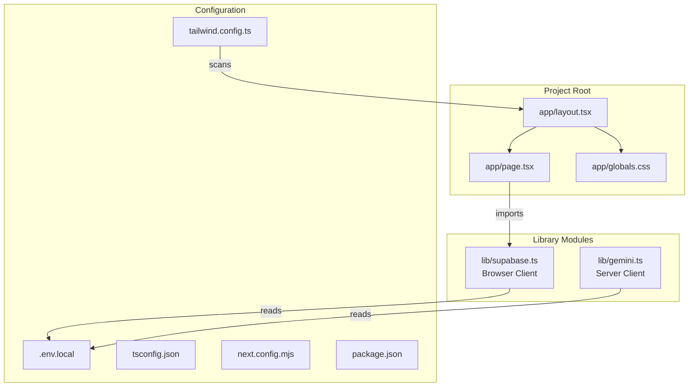

# Design Document: nextjs-scaffold

## Overview

This design describes the scaffolding of the foundational Next.js 14 project for BARCHAT. The scaffold establishes the directory structure, installs dependencies, creates utility client modules for Supabase and Gemini, configures environment variables, and ensures the project builds and runs cleanly on first attempt.

The scaffold is intentionally minimal — it provides the base upon which all subsequent BARCHAT features (check-in, bar floor, match page, chat, drinks) are built. No application logic beyond client initialization is included.

### Design Decisions

1. **Single shared Supabase client instance** — The browser client is created once at module level and re-exported. This avoids creating multiple GoTrue/Realtime connections per page and matches Supabase's recommended pattern for client-side SPAs.

2. **`server-only` package for Gemini module** — Next.js's `server-only` package causes a build-time error if the module is imported in a client component. This is the official Next.js mechanism for enforcing server boundaries, simpler and more reliable than runtime checks.

3. **Exported model constant** — The default model identifier (`gemini-2.5-flash`) is exported as a named constant rather than hardcoded in each call site. This makes model changes a single-line edit.

4. **Fail-fast on missing env vars** — Both client modules throw immediately if required environment variables are missing. This surfaces misconfiguration at startup rather than producing cryptic runtime errors deep in API calls.

5. **No `src/` directory** — The project uses the flat `app/` and `lib/` layout at the root. This is simpler for a hackathon project and avoids an extra nesting level.

---

## Architecture



The architecture is flat and minimal:
- `app/` contains the Next.js App Router pages and layout
- `lib/` contains shared utility modules (Supabase client, Gemini client)
- Configuration files live at the project root
- No intermediate layers, no abstractions beyond what the libraries provide

---

## Components and Interfaces

### 1. `app/layout.tsx` — Root Layout

```typescript
// Responsibilities:
// - Wraps all pages with <html> and <body> tags
// - Sets viewport meta tag (width=device-width, initial-scale=1)
// - Imports global stylesheet (globals.css)
// - Sets metadata (title, description)

export const metadata: Metadata = {
  title: "BARCHAT",
  description: "Meet strangers at Bangkok bars with a 15-minute countdown",
};

export default function RootLayout({ children }: { children: React.ReactNode }) {
  // Returns <html><body className="max-w-[390px] mx-auto">{children}</body></html>
}
```

### 2. `app/page.tsx` — Landing Page

```typescript
// Minimal placeholder page
// Renders the BARCHAT logo/title and a "Scan QR to join" message
// No interactivity — just confirms the scaffold works
export default function Home() { ... }
```

### 3. `app/globals.css` — Global Stylesheet

```css
@tailwind base;
@tailwind components;
@tailwind utilities;

/* Minimal base styles for mobile-first 390px target */
```

### 4. `lib/supabase.ts` — Supabase Browser Client

```typescript
// Interface:
import { createClient, SupabaseClient } from "@supabase/supabase-js";

// Validates env vars at module load time
// Throws Error("Missing NEXT_PUBLIC_SUPABASE_URL") if undefined
// Throws Error("Missing NEXT_PUBLIC_SUPABASE_ANON_KEY") if undefined

// Exports:
export const supabase: SupabaseClient;
// Single shared instance — same object returned on every import
```

### 5. `lib/gemini.ts` — Gemini Server Client

```typescript
// Interface:
import "server-only";
import { GoogleGenAI } from "@google/genai";

// Validates env var at module load time
// Throws Error("Missing GEMINI_API_KEY") if undefined

// Exports:
export const ai: GoogleGenAI;
export const DEFAULT_MODEL: string; // "gemini-2.5-flash"
```

### 6. `.env.local` — Environment Variables

```
NEXT_PUBLIC_SUPABASE_URL=your-supabase-project-url
NEXT_PUBLIC_SUPABASE_ANON_KEY=your-supabase-anon-key
GEMINI_API_KEY=your-gemini-api-key
```

### 7. `tailwind.config.ts` — Tailwind Configuration

```typescript
// content paths include "./app/**/*.{ts,tsx}" and "./lib/**/*.{ts,tsx}"
// Uses default theme (no custom extensions needed for scaffold)
// Mobile-first breakpoint strategy is Tailwind's default behavior
```

### 8. `tsconfig.json` — TypeScript Configuration

```json
// strict: true
// Includes path alias: "@/*" → "./*"
// Standard Next.js 14 TypeScript configuration
```

### 9. `README.md` — Project Documentation

Structure:
1. Project title and one-liner description
2. Tech stack list
3. Getting started / setup instructions
4. Environment variables table
5. **Security** section (RLS disabled acknowledgment)
6. Available scripts

---

## Data Models

This scaffold does not define application data models — those are handled by the Supabase schema defined in `BARCHAT.md`. The scaffold's "data" is limited to:

### Environment Variable Schema

| Variable | Scope | Required | Used By |
|----------|-------|----------|---------|
| `NEXT_PUBLIC_SUPABASE_URL` | Client + Server | Yes | `lib/supabase.ts` |
| `NEXT_PUBLIC_SUPABASE_ANON_KEY` | Client + Server | Yes | `lib/supabase.ts` |
| `GEMINI_API_KEY` | Server only | Yes | `lib/gemini.ts` |

### Module Export Types

```typescript
// lib/supabase.ts
export const supabase: SupabaseClient;

// lib/gemini.ts
export const ai: GoogleGenAI;
export const DEFAULT_MODEL: "gemini-2.5-flash";
```

---

## Correctness Properties

*A property is a characteristic or behavior that should hold true across all valid executions of a system — essentially, a formal statement about what the system should do. Properties serve as the bridge between human-readable specifications and machine-verifiable correctness guarantees.*

PBT (property-based testing) does not apply to this feature in the traditional sense. The nextjs-scaffold is a project scaffolding task — it creates files, installs dependencies, and configures a development environment. There is no algorithmic logic with a meaningful input space that would benefit from randomized testing.

Specifically:
- **File creation** is deterministic — files either exist with the correct content or they don't (smoke tests)
- **Environment variable validation** has exactly two states per variable: present or absent (example-based unit tests)
- **Client initialization** is configuration wiring with no transformation logic (example-based unit tests)
- **Build verification** is a pass/fail integration check (smoke tests)
- **Singleton pattern** is a structural property verified by reference equality (example-based unit test)

### Property 1: Env var validation fails fast on missing variables

*For any* required environment variable that is undefined or empty, the corresponding client module (`lib/supabase.ts` or `lib/gemini.ts`) SHALL throw an Error at module load time with a message identifying the missing variable.

**Validates: Requirements 3.4, 4.6**

### Property 2: Supabase client singleton identity

*For any* number of imports of `lib/supabase.ts` across different modules, the exported client instance SHALL be referentially identical (same object reference).

**Validates: Requirements 3.5**

### Property 3: Server-only boundary enforcement

*For any* client-side component that imports `lib/gemini.ts`, the Next.js build SHALL fail with a build-time error, preventing the Gemini API key from being exposed to the browser.

**Validates: Requirements 4.3**

The appropriate testing strategies (unit tests, smoke tests, configuration validation) are described in the Testing Strategy section below.

---

## Error Handling

### Missing Environment Variables

Both client modules use a fail-fast pattern:

```typescript
// Pattern used in both lib/supabase.ts and lib/gemini.ts
const url = process.env.NEXT_PUBLIC_SUPABASE_URL;
if (!url) {
  throw new Error("Missing NEXT_PUBLIC_SUPABASE_URL");
}
```

This ensures:
- Errors surface immediately at module load time
- Error messages clearly identify which variable is missing
- No silent failures or undefined behavior downstream

### Build Errors

The scaffold must produce zero TypeScript errors and zero Next.js build warnings. Any type issues in the client modules are caught at build time via `strict: true` in `tsconfig.json`.

### Server-Only Boundary Violation

If `lib/gemini.ts` is accidentally imported in a client component, the `server-only` package causes a **build-time error** with a clear message. This is not a runtime check — it fails the build entirely, preventing accidental API key exposure.

---

## Testing Strategy

### Why Property-Based Testing Does Not Apply

This feature is a project scaffold — it creates files, installs dependencies, and configures a development environment. The acceptance criteria test:
- File existence and structure (smoke tests)
- Configuration correctness (schema validation)
- Module initialization with env var validation (example-based unit tests)
- Build and runtime verification (integration/smoke tests)

There is no algorithmic logic with a meaningful input space. The env var validation has exactly two states per variable (present/absent), and the client initialization is deterministic configuration wiring. Property-based testing would not provide additional value over example-based tests.

### Test Approach

**Unit Tests** (using Jest or Vitest):
- `lib/supabase.ts`: Test that missing `NEXT_PUBLIC_SUPABASE_URL` throws the expected error
- `lib/supabase.ts`: Test that missing `NEXT_PUBLIC_SUPABASE_ANON_KEY` throws the expected error
- `lib/supabase.ts`: Test that with both vars set, the module exports a SupabaseClient instance
- `lib/supabase.ts`: Test that multiple imports return the same instance (singleton)
- `lib/gemini.ts`: Test that missing `GEMINI_API_KEY` throws the expected error
- `lib/gemini.ts`: Test that with the var set, the module exports a GoogleGenAI instance
- `lib/gemini.ts`: Test that `DEFAULT_MODEL` equals `"gemini-2.5-flash"`

**Smoke Tests** (manual or CI):
- `npm install` exits with code 0
- `npm run build` exits with code 0
- `npm run dev` starts and responds on port 3000
- The landing page renders without horizontal overflow at 390px viewport

**Configuration Validation**:
- `tsconfig.json` has `strict: true`
- `tailwind.config.ts` content paths include `app/` directory
- `globals.css` contains all three Tailwind directives
- `.env.local` contains all three required variable placeholders
- `package.json` lists `@supabase/supabase-js` and `@google/genai` in dependencies

**Build Verification**:
- TypeScript compilation produces zero errors
- Next.js build completes without warnings
- No peer dependency conflicts in `npm install`
