# Design Document: Seamless Navigation

## Overview

This feature transforms BARCHAT from a set of disconnected pages into a cohesive, navigable application. It addresses four key gaps:

1. **Landing page is a dead end** — no actionable entry points exist
2. **No inter-page navigation** — users cannot move between bar/match/home
3. **Photo upload requires URL pasting** — friction that breaks the mobile-first UX
4. **No error recovery paths** — errors leave users stranded

The design introduces contextual navigation elements, a native photo picker component, a match transition overlay, and error recovery patterns — all within the existing Next.js App Router architecture using client-side navigation (`useRouter`).

## Architecture

```mermaid
graph TD
    Landing["/  Landing Page"] -->|"Enter Bar"| Checkin["/checkin  Check-in Page"]
    Landing -->|"Back to Bar"| Bar["/bar  Bar Page"]
    Checkin -->|"Success + toast"| Bar
    Checkin -->|"Cancel"| Landing
    Bar -->|"Match detected + overlay"| Match["/match/[id]  Match Page"]
    Match -->|"Match ended → Back to Bar"| Bar
    Bar -->|"BARCHAT logo tap"| Landing

    style Landing fill:#1a1a2e
    style Checkin fill:#16213e
    style Bar fill:#0f3460
    style Match fill:#533483
```



**Navigation Rules:**
- Landing → Checkin: always available ("Enter Bar")
- Landing → Bar: only when Session_State exists ("Back to Bar")
- Checkin → Bar: on successful submission (programmatic)
- Checkin → Landing: back/cancel link (always available)
- Bar → Match: on realtime match event (programmatic, with overlay)
- Bar → Landing: logo tap (always available)
- Match → Bar: only after match ends (conditional)
- Match → nowhere: during active match (no escape)

**Key Architectural Decisions:**
- All navigation uses Next.js `useRouter().push()` for client-side transitions (no full page reloads)
- Session state is read from `localStorage` (`barchat_profile_id`) — no auth layer
- Photo storage uses base64 data URLs in the `photo_url` column (no separate file storage service needed for MVP)
- Match overlay is a portal-style component rendered within the Bar page, not a separate route
- Toast notifications use a lightweight custom component (no external toast library) to avoid adding dependencies

## Components and Interfaces

### 1. Landing Page (`app/page.tsx`)

**Changes:** Convert from server component to client component. Add session detection and conditional button rendering.

```typescript
interface LandingPageState {
  hasSession: boolean; // derived from localStorage on mount
}
```

**Renders:**
- "BARCHAT" heading + tagline (≤10 words)
- "Enter Bar" button → `/checkin?venue=craft-draft-thonglor` (always)
- "Back to Bar" button → `/bar` (only when `hasSession === true`)

### 2. PhotoPicker Component (`app/checkin/PhotoPicker.tsx`)

New standalone component for the check-in page.

```typescript
interface PhotoPickerProps {
  value: string | null;        // current base64 data URL or null
  onChange: (dataUrl: string | null) => void;
  error?: string | null;
}

interface PhotoPickerState {
  isDragOver: boolean;
  previewUrl: string | null;
  validationError: string | null;
}
```

**Validation logic (pure function, testable):**

```typescript
interface FileValidationResult {
  valid: boolean;
  error?: string;
}

function validateImageFile(file: File): FileValidationResult {
  const ALLOWED_TYPES = ['image/jpeg', 'image/png', 'image/webp'];
  const MAX_SIZE_BYTES = 5 * 1024 * 1024; // 5 MB

  if (!ALLOWED_TYPES.includes(file.type)) {
    return { valid: false, error: 'Only JPEG, PNG, and WebP images are accepted.' };
  }
  if (file.size > MAX_SIZE_BYTES) {
    return { valid: false, error: 'Image must be under 5 MB.' };
  }
  return { valid: true };
}
```

**Conversion logic:**

```typescript
function fileToBase64DataUrl(file: File): Promise<string> {
  return new Promise((resolve, reject) => {
    const reader = new FileReader();
    reader.onload = () => resolve(reader.result as string);
    reader.onerror = () => reject(new Error('Failed to read file'));
    reader.readAsDataURL(file);
  });
}
```

### 3. MatchOverlay Component (`app/bar/MatchOverlay.tsx`)

Full-screen overlay shown when a match is detected.

```typescript
interface MatchOverlayProps {
  matchId: string;
  profileA: { display_name: string; photo_url: string | null };
  profileB: { display_name: string; photo_url: string | null };
  onComplete: () => void;  // called after 1.5s or on tap
}
```

**Behavior:**
- Renders a full-screen fixed overlay with fade-in animation
- Shows both users' names and photos (or initial-letter placeholder)
- Auto-navigates after 1500ms via `setTimeout`
- Tap anywhere triggers immediate `onComplete()`
- Cleanup clears the timeout on unmount

### 4. Toast Component (`app/components/Toast.tsx`)

Lightweight notification component.

```typescript
interface ToastProps {
  message: string;
  duration?: number;  // default 3000ms
  onDismiss: () => void;
}
```

### 5. Navigation Header (`app/bar/BarHeader.tsx`)

Header component for the Bar page showing venue name, user info, and home link.

```typescript
interface BarHeaderProps {
  venueName: string;
  displayName: string;
  intentLabel: string;
}
```

### 6. BackToBar Link (within Match Page)

Conditional navigation element rendered inside the existing Match page layout.

```typescript
// Condition for rendering:
const matchEnded = match.met_at !== null || Date.parse(match.expires_at) <= Date.now();
```

## Data Models

No new database tables or columns are required. The feature uses existing data:

| Source | Field | Usage |
|--------|-------|-------|
| `localStorage` | `barchat_profile_id` | Session detection for conditional navigation |
| `profiles` | `display_name`, `photo_url` | Overlay display, header display |
| `presence` | `venue_id`, `intent` | Header badge, venue name lookup |
| `venues` | `name` | Header venue name |
| `matches` | `expires_at`, `met_at`, `profile_a`, `profile_b` | Match-ended condition, overlay data |

**Photo storage change:** The `photo_url` column in `profiles` will now store base64 data URLs (e.g., `data:image/jpeg;base64,...`) instead of HTTP URLs. The column type (`text`) already supports this. Existing URL values remain valid — the UI renders both formats via ``.

**URL search param:** The check-in page reads `venue` from the URL query string (e.g., `/checkin?venue=craft-draft-thonglor`). This is unchanged.

## Correctness Properties

*A property is a characteristic or behavior that should hold true across all valid executions of a system — essentially, a formal statement about what the system should do. Properties serve as the bridge between human-readable specifications and machine-verifiable correctness guarantees.*

### Property 1: Match-ended navigation visibility

*For any* match state (with any `expires_at` timestamp and any `met_at` value including null), the "Back to Bar" navigation link is visible if and only if the match has ended (i.e., `met_at` is not null OR `expires_at` is in the past).

**Validates: Requirements 2.1, 2.2, 4.3**

### Property 2: Photo file validation correctness

*For any* file with any MIME type and any size, the `validateImageFile` function returns `{ valid: true }` if and only if the file's MIME type is one of `image/jpeg`, `image/png`, or `image/webp` AND the file's size is less than or equal to 5,242,880 bytes (5 MB).

**Validates: Requirements 3.1, 3.6**

### Property 3: Photo base64 conversion round-trip

*For any* valid image file (JPEG, PNG, or WebP, ≤5 MB), converting it to a base64 data URL via `fileToBase64DataUrl` produces a string that starts with `data:image/` and contains valid base64-encoded content that, when decoded, equals the original file bytes.

**Validates: Requirements 3.5**

## Error Handling

| Page | Error Condition | User-Facing Behavior | Recovery Action |
|------|----------------|---------------------|----------------|
| Landing | localStorage read fails | Treat as no session (show only "Enter Bar") | None needed |
| Check-in | Venue not found (invalid slug) | Error message + "Go Home" link to `/` | Tap "Go Home" |
| Check-in | Profile creation fails | Error message inline, form remains filled | Fix input, retry submit |
| Check-in | Navigation to /bar fails after success | Error message + manual "Go to Bar" link | Tap link |
| Bar | No `barchat_profile_id` | Redirect to Landing (`/`) | Automatic |
| Bar | Profile exists but no active presence | Error message (no patron cards shown) | Re-check-in via QR |
| Bar | Patron data fetch fails | "Try Again" button + "Go Home" link | Tap "Try Again" or "Go Home" |
| Bar | Retry also fails | Same buttons + updated error message | Same options persist |
| Match | Match not found / load error | Error message + "Back to Bar" link | Tap "Back to Bar" |
| Match | Match overlay data incomplete | Skip overlay, navigate directly | Automatic fallback |

**Error element accessibility:** All error recovery buttons and links are rendered with:
- Native `<button>` or `<a>` elements (keyboard-focusable by default)
- Positioned in the vertical center of the viewport (visible without scrolling)
- Minimum tap target of 48×48px
- `role` and `aria-label` attributes where semantic HTML is insufficient

## Testing Strategy

### Unit Tests (Example-Based)

Focus on specific scenarios and edge cases:

- **Landing page rendering:** Verify correct buttons appear based on session state
- **PhotoPicker interactions:** Drag-over indicator, tap opens file browser, preview replacement
- **MatchOverlay timing:** 1.5s auto-navigation, tap-to-skip
- **Toast auto-dismiss:** Disappears after 3 seconds
- **Bar header rendering:** Venue name, display name, intent badge
- **Error states:** Each page's error UI renders correct recovery elements
- **Redirect guard:** Bar page redirects when no session exists
- **Multi-file drop:** Only first valid image is used

### Property-Based Tests

Using `fast-check` as the PBT library for TypeScript/React:

- **Property 1 (Match-ended navigation):** Generate random `{ expires_at: Date, met_at: Date | null }` objects. Assert that the `matchEnded` derivation equals the visibility of the "Back to Bar" element. Minimum 100 iterations.
  - Tag: `Feature: seamless-navigation, Property 1: Match-ended navigation visibility`

- **Property 2 (File validation):** Generate random `{ type: string, size: number }` file descriptors. Assert that `validateImageFile` returns valid iff type ∈ allowed set AND size ≤ 5MB. Minimum 100 iterations.
  - Tag: `Feature: seamless-navigation, Property 2: Photo file validation correctness`

- **Property 3 (Base64 round-trip):** Generate random byte arrays (representing image content), wrap in File objects with valid MIME types. Assert that `fileToBase64DataUrl` output starts with `data:image/` and that decoding the base64 portion yields the original bytes. Minimum 100 iterations.
  - Tag: `Feature: seamless-navigation, Property 3: Photo base64 conversion round-trip`

### Integration Tests

- Full check-in → bar navigation flow with mocked Supabase
- Match realtime event → overlay → match page navigation
- Error recovery: failed fetch → "Try Again" → successful retry loads patrons

### Test Configuration

- PBT library: `fast-check` (well-maintained, TypeScript-native)
- Test runner: Vitest (compatible with Next.js, fast, supports React Testing Library)
- Minimum 100 iterations per property test
- Each property test references its design document property via comment tag
